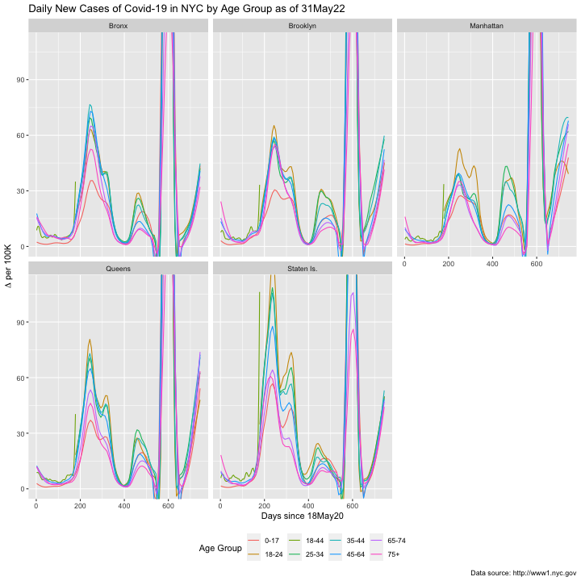

```{r setup, include=FALSE}
knitr::opts_chunk$set(echo = TRUE, tidy=T, cache = F)
#library(flexdashboard)
library(reshape2)
library(dplyr) 
library(ggplot2)
library(ggrepel)
library(GGally)
require(ggExtra)
require(grid)
require(gridExtra)
library(lubridate)
require(RCurl)
require(rvest)
require(haven)
require(tibble)
require(foreach)
require(parallel)
require(doParallel)
require(ape) #for Moran's I
require(vtable)

evalFlag <- T #use eval option to turn off chunks
DRAFT <- T #include some results not used in paper
```

```{r common-code-1, echo=F, message=FALSE, warning=FALSE, include=T}
rsltList <- NULL #base for betas/se, both NYC and London
#note: currently does not read in resids!
#CHANGE THIS (to F) to re-do newly imputed runs:
readFromFile <- c("NYC","LON","BOTH","NEITHER")[3]
logVarNames <- c("PercentHispanic","PercentBlack","MedianInc") #take log of these variables before using them.
#redoVarNames <- logVarNames[3] #to save time on London re-runs when taking logs.
redoVarNames <- c()
tsOrder <- c(1,11,8,2,3:7,9,10,12) #for time series plots
removeSI <- F #important choice for NYC time series
splitBoros <- T # divide Boros into multiple regions for variation on FE model
stdModel <- c(F,F) #nycHH/LAs as REs in 8 key intervals (NYC,Lon)
lastDate <- as.Date("2022-05-30")
wkgPopFrac <- .572 #from 2019 NYS data (web search)
mimFactor <- ifelse(stdModel[2],1,1) #divisor - for debugging with smaller number of Multiple Imputes
```
# Introduction {#sec:intro}

The first case of COVID-19 was identified in December 2019 [@Zhu20], in Wuhan, China. The reaction of governments varied greatly, and air travel continued, reasonably normally, until late January, 2020, when for example British Airways cancelled all flights to and from Wuhan, as cases spread throughout Europe. London, UK, being a hub of international travel, detected its first cases on February 11th. New York City (NYC), despite some travel restrictions, became one of several early hotspots in the USA by March. The focus of this paper is on these two international cities, whose experiences, although quite similar, differed in ways that suggest how policy, personal circumstances and human behavior interact to spread and contain a viral outbreak. We track the progression of this disease over the course of two years, aligning a set of publicly available, demographic measures across the cities to build a harmonized data set. We use a coordinated set of spatio-temporal analyses, eventually pooling results in a manner that allows each city to contribute maximally to our understanding of the disease's progression through communities. At different times, one city provides more precise information than another, and we exploit this, borrowing strength across sites to establish the overarching narrative.

We limit our analysis to surveillance data -- publicly available data released by the Greater London Authority (GLA) and NYC's Health Department (DOH). These data are released as aggregate daily or weekly counts for neighborhoods, specifically Middle Layer Super Output Areas (MSOAs) in London, and Zone Improvement Plan (ZIP) Codes in NYC. While individual records and thus demographics are not provided, we link these data to Office of National Statistics (ONS) and US Census data to construct a neighborhood profile associated with incidence. This is an ecological analysis that tracks the movement of the virus through various neighborhoods. Note that while we cannot guarantee that our study reflects *individuals* with specific demographic characteristics [unlike @Jarvis2020], we know that it reflects neighborhoods and thus communities, and this is one vector for disease spread. By synthesizing the relationships between demographics associated with multiple neighborhoods and incidence, we build a narrative of the progression of the virus through time and place. The observed similarities and differences, as well as our method for combining information, suggests that policies that respond to surveillance across multiple sites would benefit from closer coordination or a global, rather than local perspective.

## Why study these two global cities?
London and New York City have equivalent population size (8.8m for NYC; 9m for London in 2020), they play comparable roles in the world (as cultural hub, tourist destination, and financial center). Both cities share comparable geographic locations, as an international gateway to a vast area (Europe and the continental US, respectively). This generated similar population development and the corresponding labor market associated with the role.

Both cities are demographically similar but not identical. London is 60\% white, while NYC is 40\%. Their immigrant population is, however, similar in size at 35-40\% of the total designated "foreign born". Historically colonized or formerly enslaved populations make up a significant fraction of the non-white population, with about 25\% Black in NYC, and a similar fraction non-white from former colonies (e.g., India, Pakistan, Bangladesh and the Caribbean) in London. Another notable commonality is their transport system serving a different population density (with NYC's being more dense) and both displaying significant variation within geographically dispersed areas with more suburban areas in outer London boroughs and similarly in Staten Island and Eastern Queens, NYC.

Demographic characteristics such as these likely correlate with differences in exposure and thus incidence rates; the timing of the introduction of variants will also be shown to play a role. 
Our aim is to quantify the relationship between specific factors and disease progression, with an emphasis on the extent to which they may collectively explain cross-city similarities and differences. We take as premise that geographic variation most likely arises from diverse, if inter-related, sources [@Cummins12].

The story that emerges from this analysis involves imperfect information that gradually improves in conjunction with misinformation and policies based on both. It also involves exposure differences linked to work and family responsibilities, healthcare systems, and personal choices reflecting priorities or a sense of responsibility towards one's community. Our methodological approach reflects two objectives: through surveillance, to learn as much about the course of the disease as possible; through statistical methods for data combination, to understand how cities and their governments can learn from one another dynamically.

More precisely, we develop geo-spatially adjusted models for virus incidence as a function of neighborhood characteristics, linking the information across the two cities, and noting how the relationships - and thus affected populations - change over time.
We begin with a comparison of city demographic measures and their interrelationship, finding them roughly similar in perhaps surprising ways. In other words, residential differentiation along class, race and age dimensions follow similar patterns in each city. We relate these characteristics to disease incidence over time, building a time-series that establishes which types of communities were affected the most and least, and whether the experiences were aligned. 
We then organize a set of longitudinal analyses into eight key periods of the pandemic and give a brief overview of the relevant, overarching policies that were implemented in each city at the time. This allows us to more precisely define alignment of disease progression over time, borrowing statistical strength across studies to establish the pattern. The sections are organised as follows: data description and demographic comparison, methodological overview, findings and synthesis. We conclude with a discussion of limitations in the data and level of analysis, referencing additional data sources to corroborate some of our findings.

# Data {#sec:Data}

## Disease Incidence / Unit of Analysis

London data were taken from Public Health England made available under Open Government Licence \href{https://www.nationalarchives.gov.uk/doc/open-government-licence/version/3/?_ga=2.58586536.367844588.1655460535-377114228.1653387940}{v3.0}. The variable used throughout are the cumulative 7-day weekly count of positive cases. We use the specimen date (the date the sample was taken from the person being tested). We chose Sundays as the last day of week to conform with standard calendar formats. So our first 2020 7-day count of positive cases included is in week 12 (ending Sunday March 22, 2020) when we observe 1146 positive cases. The London unit of measurement is the MSOA (Middle Super Output Area) which are small geographical area of mean population size of around 9000 residents (sd=1938), 90% of the MSOAs have between 6551 and 12541 residents (as of mid 2018). To ensure confidentiality of the data count at low geographical level, total cases were set to missing when less than 3 (ie. 0, 1 or 2) by Public Health England. We detailed in Section \@ref(sec:MisDat) our treatment of missing cases. The number of missing cases are large in the initial period but reduced notably as mass testing was introduced from Autumn/Fall 2020 (lateral flow tests results were also added to this data during this period). To this data on Covid-19 positive cases, we add data made available at MSOA level by the Office for National Statistics (ONS). These are population sizes evaluated at mid-2018, percentages with at least bachelor degree (BA), and belonging to ethnic minorities which are both computed from the census 2011. MSOA mean incomes are computed by the Greater London Authority (GLA). Obesity rates (defined as BMI above 30) are provided by Public Health England for the latest period available (2006-08) as are the proportion with Asthmatic conditions (COPD). Ethnicity is taken from the 2011 census, and we use percentages identifying as Asian and Asian British and those identifying as Black (which we call 'Hispanic' to match populations with similar characteristics in NYC), African, Caribbean and Black British (Black). The 

NYC incidence data were taken from its Department of Health website, where daily counts of cases, hospitalizations and deaths were recorded. Our outcome of interest is case counts. In March 2020, only aggregate data were released, but over time, Age, Sex, Race and ZIP code level data became available, eventually stratified by borough as well (e.g., we might learn that older people in Manhattan had lower infection rates than older people in The Bronx). The unit of analysis is the geographic area (ZIP code) and the primary measurement is case count over time.[^data_lim]
ZIP level data was subject to many adjustments over the course of the pandemic that induce some missingness in the data (to be explained). Nearly all of the data that we report for NYC has the following limitation: it is associated with the date of release, not the date of testing. Unlike London data, NYC data is never adjusted and re-released at the ZIP code level (re-releases are only for aggregate groups). During the first six months of the pandemic, the lag between test date and release date was quite substantial (approximately 7 days), but this reduced to one to three days by late 2020 - early 2021. In nearly every analysis we do, the data are aggregated weekly to limit this effect, although a one-week lag persists in the first six months. As a robustness check, we compared our unadjusted, weekly totals to the adjusted totals provided by the city, and for the most part, the key difference is a one-week lag that diminishes substantially in the first year of the pandemic. Nearly every analysis we do examines time-constant, demographic features aggregated to the ZIP code level and estimates their relationship to the ZIP level case rate. This makes lag effects more relevant to the comparisons to London, but we expect that differences will be at most one week in the first few phases of the study. We also shifted each week's end date by 24 hours so that the London and NYC data align more closely.

[^data_lim]: Other data extracts provided by the city's Department of Health have limitations and were not at the ZIP code level: age data is aggregated into specific intervals, and these were modified halfway through the pandemic; race data was collected almost exclusively from hospital records, thus is not representative of positive cases, but rather of severe cases (this remains true even two years into the pandemic).  

### General Data Consideration

Both cities collected aggregate data (daily counts) from the onset of the disease. Initially, cases were identified in hospital settings, sometimes via post-mortem. In London, community testing was delayed, as the health system was flooded with cases. This led to nearly all cases in the first two months to be severe cases. In NYC, the situation was somewhat different, in that individuals who had symptoms, however mild, were often advised (via telemedicine) to seek PCR testing quite early in the pandemic. Those who returned from foreign travel and later developed symptoms were either tested immediately, or after a month were advised to seek an antibody test, confirming prior disease. This suggests that both cities underreported true cases for most of the first wave. As data systems shifted toward surveillance, these biases waned, although the selection into testing process is embedded in these data.

London provided weekly, adjusted, data at the level of the MSOA from the outset. However, for confidentiality reasons, counts below 3 were censored, and only counts aggregated to the Local Authority level are complete. We treat this as a missing data issue, using a constrained multiple imputation technique. In contrast, NYC did not begin providing ZIP Code level new case counts until the week ending 18 May 2020, so in all but the first analysis we begin both series at that point. 

## Demographics

In lieu of individual records and in line with a surveillance approach to understanding the course of the disease through populations, we extract demographic information at the neighborhood level and link it to reported incidence at that same level. 
These demographics will help build a narrative regarding community exposure and through the variation in community characteristics inform behavioral differences.

**Essential/Critical workers** are defined as 'at risk' workers in the UK data. The definition is survey based (Labour Force Statistics), where a worker is classified as 'at risk' if their occupation (4 digit SOC) score high on a 0-100 scale measuring proximity with others (0 is 'no contact' and 100 is 'touching'). In NYC, such a detailed scale is not available, but we do have the industries of workers in each geographic area from the ACS (2017). We defined 'essential' workers to include:  Retail; Wholesale; Transportation and Warehousing; Entertainment, Accommodation and Food Services; Employment, Health Care and Social Assistance; Employment, Accomodation and Food Services; Production, Transportation, and Material Moving. Jobs in these industries involve either public facing work or 'factory' work that involves a lot of exposure to fellow workers. This list matches closely occupations with high risk of COVID-19 hospitalization and deaths (see @Chen2021). We excluded the general service industry, as it is too broadly defined (including many administrative jobs that moved to remote work). Robustness checks did not reveal striking differences with this removal.

**Age** is separated into two measures, percent younger and percent older, where younger is age 17 and under, and older is 65 and older. Age 17 is close to the initial vaccine eligibility cutoff and mortality risk is much higher for those 65 and older; once individuals become aware of their personal (conditional) risk, presumably they will take appropriate precautions. In making our choices, we were somewhat limited by available age cutoffs from US Census and ONS data. Note as well that it is possible, but not likely, for a neighborhood to be disproportionately younger and older at the same time (young families living in close proximity with elder housing).

**Race/ethnicity** 

In the UK, MSOA level demographic information was amassed from the 2011 Census. The Black population in London is more broadly defined, we use the \% identifying as Black, African, Caribbean, Black British as referred in the 2011 census. In NYC, anyone with African heritage is identified as Black. Both of these populations have historically suffered from residential segregation that included disproportionate exposure to environmental hazards such as pollution. Hispanic or Latino may be of any race, and this designation is collected as well. While ethnically very different, the Bangladeshi and Pakistani populations in London are often filling similar roles in the labor market as the Latino population does NYC. For example, they are disproportional represented in the Essential Worker population [@Vahe2021].

**Income**  

We considered two measures of economic means, percent of the population below the poverty line and median income. We determined that the measures were more comparable using income, as definitions of populations in poverty vary by city, and the welfare state differs somewhat between them.[^pov_meas]
We use the logged version of this measure, as changes in it approximate percentage relative difference, and its distribution is reasonably symmetric in both cities. 

[^pov_meas]: While percent living in poverty measures and (log) median income are correlated at 0.80-0.90, depending on the city, we prefer to use median income for cross-national comparisons and for its distributional properties.

**Health Risk**

At the outset of the pandemic, a concern was that individuals with respiratory problems (e.g., asthma, chronic obstructive pulmonary disease (COPD)) were more 
likely to have a severe case of the disease. They were thus more likely to have symptoms and get tested, and during the initial phases, selection -- who got tested -- mattered more. However, health concerns could function in the opposite manner: once recognized as being more at risk, such individuals might change their behavior to avoid infection. In this study, we examine two co-morbitities, obesity and COPD (Asthma in the UK), taken from NHS Digital (Quality of Care Framework, QOF, 2019), and ACS as a fraction of the neighborhood population.

**Education** 
We operationalize education as having a four-year (Bachelor's) degree or higher. This serves as a marker of social class, earning potential, allowance to work from home, and possibly trust in government/scientific authority.


**English Language** 

In the US this rate is how often English is the *only* language spoken at home, while in the UK, it is every households where noboby speaks English as the main language divided by all households in the MSOA.   {AD: Confirm - this is a guess DONE. Are you using (FoLa) or (1-FoLa) ? Should we build a table of means?}


**Other Measures**

We considered using a few other measures, but most were captured already by others or were not as clearly connected to exposure. A good example is commute time, which could be long or short for a variety of reasons and transport might not be a primary exposure site depending on masking restrictions/enforcement.


## Comparison of demographics

We examine the correlation of our eleven geospatially-derived neighborhood characteristics
within larger geographic areas (the five boroughs in NYC; the five compass-based divisions of London) and then pooled. We refer primarily to the aggregate correlations, but it should be understood that for some relationships, the differences between geographic regions is notable.

Overall, neighborhoods with more essential workers have more young children, lower education levels, and tend to be poorer. In fact, the strongest correlation is between essential worker and BA+, at -0.9 in both cities. There is a strong correlation between fraction of essential workers and Latinx proportion in NYC (0.7), but this relationship is weaker in London, in which the comparable population is Bangladeshi/Pakistani, and the correlation is 0.3 on average, reaching 0.7 only in West London. Language spoken at home, a rough proxy for immigrant status follows a similar pattern in both cities; the relationship between English as primary language and percent Latinx in NYC at -0.6 and for percent Bangladeshi/Pakastani at -0.7 in London. Neighborhoods that have larger older populations tend to be wealthier in both cities, but the strength of this relationship is weaker (0.4-0.5 in most comparisons) and varies more by region. The residential segregation of white communities versus communities of color is fairly consistent in both cities. For example, the percent white versus Black in a neighborhood is correlated at -0.8 in NYC and -0.6 in London.

Ideally, we would have individual-level data for each case, with the individual's race, sex, age, place of residence, essential worker status, mode of transport to work, education, etc. Privacy (and collection burden) issues are likely the rationale for not making this publicly available. However, particularly in London, the size of the areal unit under study is quite small, averaging ~1000 people each, and residential segregation is substantial in both cities at that scale. In terms of the labor force, some neighborhoods have few essential workers, whereas others have more concentrated populations (the range is 10-40% or 15-45% London and NYC, respectively; this minor difference could be due to size of the areal unit or worker definitions). In London, the range for those with at least a Bachelor's degree is 10-60%, while it is 10-90% in NYC. This reflects greater segregation along class lines in NYC, strengthening our extrapolation from neighborhoods to the people who live in them. The range in NYC is even more striking when one considers that ZIP Codes have on average, 5000 residents. Percent with English as the primary language at home ranges from 60-100% in London to 15-90% in NYC, while percent white essentially ranges from 0-100% in both cities. These four features: labor market position, education (both partial markers for class), language (marker for immigrant status), and race/ethnicity capture a key set of demographics and show great variation within each city. Some measures have low variability (e.g., age and health measures), and we are both unable to identify significant relationships between them and disease incidence, for the most part; were we able to so identify a relationship, the limited variability would force us to be skeptical that differences at the neighborhood level translate to individuals. 

# Analytic strategy {#sec:analytic}

We build a model for the COVID case count in areal unit $i$ in period $t$, denoted by $Y_{it}$ as a function of one of eleven time-constant characteristics of individuals in each neighborhood, denoted by $X_{i}$ using a Poisson regression that will take one of two forms, to be described. As in any Poisson regression, we control for exposure by including a log-exposure term in the model. In this study that exposure is the number of residents in each area, which we denote $n_{it}$. We index it by occasion to allow the government agencies to make adjustments to population counts, but in practice, these values are based on government census, and are fixed for the duration of the study. Arguably, this number drops when people die, but this effect should be minimal. In addition, in all models, we control for the large geographic areas designated by boroughs in NYC and the five geographic areas of London. When possible, we will control for a slightly smaller geographic area (to be described shortly) using fixed effects. For the purposes of this discussion, we will denote the larger regional effects by $\delta_j$ and the smaller regional effects by $\alpha_{ij}$, where for example MSOA $i$ is contained in Local Authority (LA) $j$. 

In the first form of the model, we fit separate regressions for each week of the study, reporting the adjusted correlation coefficients as a time-series, with 95\% confidence bounds based on the s.e. of the estimate. In NYC the fixed effects are restricted to borough, while in London, they represent Local Authority. At a more refined level, random effects for MSOA and ZIP code are included. In these models the ratio of smaller geographic areas to the larger ones is approximately the same in each analysis at around 30-40 to one. These time series establish the trend in the demographic correlates of incidence, allowing us to identify any gross differences between the evolution in the two cities -- how aligned or divergent they are. To the extent that one city always supersedes the other, this form of surveillance can inform policy, allowing cities to learn from each other in real time.

In the second form of the model, we pool 10-20 weeks in groups based on eight key periods of the study (roughly the four seasons). To allow for the overall trend identified in the time series, we include a cubic polynomial in time, as changes in who is more likely to have the disease when are not abrupt. We denote the polynomial $S(t)$ and note that $t$ is the week since the start of the period of interest ($S$ can be understood as a *smooth*). Given the repeated measures, we include random effects for ZIP codes and MSOAs. This is one mechanism to adjust the standard errors of the estimates for the within areal-unit autocorrelation.  The repeated measures reduce impact of missing data in London, as most intervals contain some periods of high incidence and thus low missingness. We obtain more precise estimates and are able to strengthen comparisons across cities accordingly.
In the NYC models, we include fixed effects for 11 borough-specific geographic areas built from a larger set constructed by New York Health and Hospitals (NYHH), while we use fixed effects for the 32 Local Authorities in London. The choice in NYC is an attempt to have a sufficient number of smaller areal units inside of the larger one, while still capturing broad regional differences. 
London data are provided at a much more local level, and this is an attempt to keep the models as similar as possible in terms of the ratio of fixed (larger region) versus random (smaller region) effects, which we denote $\delta_{j}$, $\alpha_{ij}$, respectively.

In both models, the parameter of interest may be interpreted as a correlation adjusted for broad regional differences; for example, Manhattan residents on average have higher income than those in Staten Island, and they may have had lower incidence rates in the first year of the pandemic. Controlling for these differences, how does relative income within borough relate to disease incidence? The first model illuminates the wave-like nature of community spread and the manner in which NYC appears to lag behind London by 2-4 weeks for most of the pandemic.

## Model Specifics 

### Time-series 

The time-series is constructed from the estimates of a Generalized Linear Mixed Model [GLMM; @mcculloch2004generalized]. The GLMM setup for a Poisson regression relies on a latent rate $\lambda_{it}$ and linear model, estimated separately for each week $t$: 
$$
\log \lambda_{it} = \log(n_{it})+b_0+b_X X_{i}+\delta_j
$$
where $S\in\mathcal{P}_3(\Re)$, $X_i$ is the predictor of interest, $\delta_j$ is a fixed effect for large regions. The observed counts follow a Poisson distribution with parameters $\lambda_{ij}$ and 
$n_{it}$, thus $Y_{it}\sim Pois(n_{it}\lambda_{it})$, or

$$
P(Y_{it}=y|n_{it},\lambda_{it})=\frac{e^{-n_{it}\lambda_{it}}(n_{it}\lambda_{it})^y}{y!}
$$
Fixed effects are limited to Local Authority or borough, and there are no random effects as there are no repeated measures in this formulation. This allows us to use the quasi-poisson model [@mccullagh2019generalized], which handles overdispersion, a potential problem in these data.

### Key periods model

The key periods model is also a Generalized Linear Mixed Model (GLMM; @mcculloch2004generalized):
$$
\log \lambda_{it} = \log(n_{it})+b_0+b_X X_{i}+S(t)+\delta_j+\alpha_{ij}
$$
where $S\in\mathcal{P}_3(\Re)$, $X_i$ is the predictor of interest, $\delta_j$ is a fixed effect for large regions, and $\alpha_{ij}\sim N(0,\sigma^2_\alpha)$. The observed counts follow a Poisson as in the first model ( $Y_{it}\sim Pois(n_{it}\lambda_{it})$.

## Technical considerations

### Extent of adjustment 

We call these effects *adjusted* but remind the reader that they are only adjusted for regional incidence rates and overall trend (in longitudinal models). Further adjustments, such as are common in multiple regression, were rejected for several reasons, mostly technical. First, we lack statistical power, particularly in NYC, since there are only 177 unique ZIP codes, and we control for borough at a minimum. Within-borough, the number of unique ZIP codes can be as small as 14. The time-constant nature of our predictors limits additional power gained by longitudinal models. Further, many of our predictors are highly correlated with one another, adding to potential multicollinearity effects. Attempts to fit more complex models in London faced computational burdens due to multiple imputation of missing data, and we further did not wish to limit our ability to compare and contrast these two cities. We standardize all predictor effects to make them comparable across populations and with each other and interpretable as an adjusted correlation coefficient.

We are also concerned with multiple comparisons between effects or over time. In other words, if we find strong effects for predictor A and for B, was this answering one research question or two? For reasons similar to those just mentioned, we lack power, especially in NYC, to adjust for multiple comparisons, *a posteriori*. However, we divised an approach that borrows strength from the London findings, incorporates the uncertainty in the NYC ones, and yields an omnibus test on the relationship between all predictor effects using Weighted Least Squares (WLS) regression, to be described. We note that qualitatively, we can define groups of predictors that are correlated at the neighborhood level, and thus are redundant, at least for this analysis. (e.g., younger, essential, Latinx/Bangl./Pakis. and White/Income/BA+.)

### Overdispersion

There is evidence of overdispersion in these counts in the form of excessive zeros. In our cross-sectional models that form the time series, we fit a quasi-poisson model [CITE McCullough?], which directly accounts for the overdispersion. For the longitudinal models in each key period, which are Poisson regression models with random effects, we used a post-estimation correction based on the deviance residuals [CITE]. This adjustment follows the standard procedure given by (CITE Agresti?) in which deviance residuals provide an estimate of the overdispersion and then standard errors are inflated by the square root of that value.

### Spatial autocorrelation

Implicit in these models is an assumption of independence between observations, but this is unrealistic in this setting. Adjacent neighborhoods are likely to have similar experiences during the pandemic, either due to shared characteristics (observable and unobservable) or simply due to proximity, since this is an infectious disease. One way to capture the geo-spatial correlation is with models that include spatially correlated errors or random effects, potentially based on variogram models. Some software and Bayesian modeling techniques allow for such correlated error structure, but we preferred to make an additional correction to the standard errors, again using the residuals. 

We form what is equivalent to a spatially lagged auto-regressive model [CITE Anselin?], computing the correlation between residuals from each areal-unit (ZIP code or MSOA) and its first nearest neighbor. This can roughly be interpreted as the Intraclass Correlation Coefficient (ICC) in a multilevel model (MLM) in which each group is of size 2 (the paired neighbors). We ignore reuse of areal-units in this characterisation, as this is an approximation for the purposes of correcting a standard error. We then interpret this ICC in the context of a design effect for an MLM, allowing us to inflate the standard errors once more.

We find that the design effect ranges from minimal, at 1.05 to more substantial at 1.35, depending on the time period and city. An indirect benefit of evaluating the residual spatial autocorrelation is that it provides an indication of the strength of our predictors in explaining variation in counts in two ways: absolutely, across periods, and relatively, within them. With the first, we find that the first, third, seventh and eigth periods in NYC exhibit the largest residual autocorrelation, while it is the third, fifth and seventh periods in London. These would be periods in which local demographics are less able to predict a significant portion of the variation. As for relative differences, we usually find that one predictor does a better job than another in predicting incidence, so the residual autocorrelation tends to differ, correspondingly. Most notable is that in the seventh period in both cities, nearly all predictors are equally able or unable to explain the different incidence rates. We interpret this as implying that the virus is moving quickly through many populations.

### Missing Data {#sec:MisDat}
Missing data in NYC was minimal but took the following two forms. There were days that were intentionally left out, perhaps due to holidays or processing backlogs. These only minimally affect our data, as we construct weekly counts from the difference between total counts in each week. When there is a missing data gap (usually 1-3 days), we linearly interpolate to allow the weekly count to be easily reconstructed. Since gaps are smaller than our unit of analysis, this merely introduces some measurement error. The second form is introduced by our data preprocessing step as a form of data cleaning. While the NYC department of health never publicly provides adjusted retrospective data, they do adjust total counts when an error is discovered. Adjustments downward of total counts in a ZIP code could induce a negative weekly count, and we simply make this record missing as we have no clear sense of the incidence in that period. In fact, we propagate missing values until our latest total is larger than our most recent total before the gap began. These missing values occur XX\% amount of the time.

Missing data in London occurs when an MSOA has fewer than 3 cases in a given week, so it is more common, at 30\% of all MSOA-weeks (with high dispersion around this average, ie. the missing values are nearly half of the MSOA-weeks in the first wave). We have additional information that can be exploited to address those missing cases, most notably we can use Local Authority (LA) total counts for that week that include the missing cases. Thus, if we have a LA consisting of 30 MSOA with 100 new cases, and 20 of these MSOA are observed, with average count 4, we have 20 remaining counts that need to be distributed among the 10 remaining MSOAs. Rather than build a complex model to impute these values, we simply draw from a truncated multinomial distribution with weights proportional to the MSOA population under the constraint that each MSOA can have no more than 2 cases assigned to it. In our example, the only "solution" to the missing data problem is to fill each MSOA with a count of 2, but it is more common for there to be a range of potential imputes. This constrained but simple scheme is repeated 20 times to build 20 complete datasets whose parameters estimated separately and combined using Rubin's rules [@Rubin87]. Notationally, if our predictor of interest is $X$ and its effect is estimated to be $\hat{b_i}$ with standard error $se(\hat{b_i})$, indexed by $i$ to reflect the imputation number, then define two terms:
$$
V_{W} = \frac{1}{m}\sum_{i=1}^{m}se(\hat{b_i})^2, \ \ \  \ V_{B} = \frac{1}{m-1}\sum_{i=1}^{m}(\hat{b_i}-\bar{b})^2,
$$
which is the average variance of the different estimates, and the variance of the parameter estimates themselves, respectively, with $\bar{b}$ being the average of the estimates. Rubin's rule is to assign 
$$
s.e.(\bar{b}) = \sqrt{V_W+\left(1+\frac{1}{M}\right)V_B},
$$
which we do for London data on $m=20$ imputed datasets. Note that the effects of the imputation are most noticeable in the time-series plots, which reveal that during periods of lower incidence, London correlates have wider confidence bands.

# Findings {#sec:findings} 

## Time series of coefficients

We generated the time-series of adjusted effects for all 11 predictors, and provide the plots for three in Figure \@ref(fig:pooled-ts-1): the percentage of essential workers in the neighborhood, the (log) median income of the neighborhood, and the percent white. The disease incidence plot is situated above these for reference. The other correlates are often similar, or mirror images of these three, given the strong correlations, positive and negative, between many of our demographics. We choose to highlight these three because they are plausibly less threatened by the ecological fallacy. Both London and NYC have a history of racial and economic residential segregation. Using a measure akin to the Massey Index @Krieger2020, London scores 38 while NYC scores 61, which is fairly high, on a White/Other Dissimilarity Index scaled from 0 to 100.[^segregation_sources] 
Economic segregation is a bit harder to compare using our data, as the size of neighborhoods differ across cities, but the coefficient of variation of median income (unlogged) is about 30\% in London and 50\% in NYC. We suspect it would be higher in London if were to compare similarly-sized neighborhoods.
Essential worker neighborhoods are highly correlated with Latinx (NYC) and Bangladeshi/Pakistani (London) neighborhoods, thus racial residential segregation maps to occupational segregation in both cities as well. 
Thus, neighborhoods with larger or smaller median income and percent white are reasonably homogeneous, allowing us to consider these *populations* as being the likely *cases* when incidence is high.

[^segregation_sources]: See \url{https://lginform.local.gov.uk/reports/lgastandard?mod-area=E92000001&mod-group=AllRegions_England&mod-metric=9040&mod-type=namedComparisonGroup} and \url{https://wherewelive.cityofnewyork.us/explore-data/where-new-yorkers-live/}.

The story that emerges is that London typically "leads" NYC by 2-4 weeks, particularly for the essential worker and median income effects. One can often predict which neighborhoods, and in some sense, *who* will be affected next in NYC by examining London today. We have noted that London incidence was under reported in the early phase due to testing policy; for the incidence plot (top panel), we made a minor correction in this period to align the *aggregate* counts using the ratio of hospitalization to cases in NYC to adjust London data. We did not attempt this at the micro data level, and this could explain why London correlates are attenuated as compared to NYC's at the very outset. The larger confidence bands in the first period are due to substantial censored (then multiply imputed) data; after that point, our confidence bounds reveal the relatively greater precision in London estimates due to its smaller areal units (MSOAs). These points underscore our contention that cities can learn from each other. We briefly highlight some of those lessons now.

In the first year of the pandemic, essential worker neighborhoods account for more cases, which clearly reflects their occupational hazard. The vaccine introduction at the start of 2021 appears beneficial for these workers, arguably even into the Omicron wave, which begins at the end of 2021. There were essentially two omicron waves, and the incidence plot (top panel) reveals this most clearly for London, for which the waves clearly precede NYC's. 

Income is a nearly mirror image of essential workers, both between and within cities, with more economically advantaged communities likely working from home or possibly leaving the city, and thus they were at lower relative risk for the first part of the pandemic. At the end of the Summer in 2020, the coupling between the cities changed with respect to income, but it returns a few months later as both cities roll out vaccination efforts. 

The differences between cities is also revealing: white population in both cities have "spikes" that belie the overall trend associated with economic roles and resources. The huge increased incidence in NYC's white neighborhoods in Fall 2020 coincides with religious backlash against masking and other restrictions on observance and politicization of health policies leading up to the US national elections. In London, the Delta wave hit sooner, and by the Summer 2021, London's neighborhoods with larger white populations seem to be more and more affected. As the omicron waves hit, both cities' largely white neighborhoods have correspondingly large increases. While the omicron variant was purported to affect everyone, relatively speaking, white wealthier neighborhoods were areas of higher incidence. Perhaps a combination of vaccination (or boosting) rates and natural immunity of those previously affected (e.g., Essential Workers) and behavior are partial explanations. We cannot rule out the possibility that some populations are reporting test results more than others, due to the availability (and in the case of NYC cost) of at home tests. This is particularly a concern in the last time period, in which health department testing became less available or even discouraged due to home testing. 


## The eight key intervals

The time series is a dynamic indicator of which communities are most affected, and a comparison across cities can establish expectations when a new wave emerges, as well as point to differences that relate to policies and enforcement thereof. A limitation in these models is their lack of precision and pooling -- they are cross-sectional analyses calculated weekly, then smoothed to identify strong trends and deviations. Periods of larger and smaller incidence appear as waves, and the correlates of incidence do as well, since different populations are more or less affected in each distinct wave. We organize this next analysis by pooling larger time intervals, each approximately one season, to both gain statistical power and minimize the effects of intermittent changes. This will establish more definitely the pattern of community spread of the disease, which we will then pool across correlates.

In Figures \@ref(fig:coefplt-3) and \@ref(fig:coefplt-1), we report the adjusted regression coefficients for London and NYC in eight key periods. Each row corresponds to a different demographic, and within the row, the ordering, top to bottom, is from Summer 2020 to Spring 2022, with colors used to enable comparisons of the same period across measures. The center point is the estimate, the inner and outer intervals are one and two standard error bounds, respectively.

For London, in Figure \@ref(fig:coefplt-3), we have the striking finding that income emerges as an important correlate in the third key period, substantially after community spread, followed by a stronger positive relationship in most of the second year of the pandemic. This stands in stark contrast to the neighborhoods with relatively more Black or Bangladeshi/Pakistani populations; they are nearly mirror images of each other. Essential worker neighborhoods are positively correlated with these two demographic groups, and that is reflected in the coefficient plot for essential workers, which mirrors them quite closely. In London, obesity follows this same pattern, perhaps more due to correlation with demographics than to health reasons, per se. There is less to day about COPD, for which variation at the MSOA level is quite low. Interestingly, the effect of age does emerge in this analysis, but it is to be understood as reflecting (mirroring) the correlation with essential worker neighborhoods, which tend to be younger in London. Older neighborhoods may have avoided high incidence in Winter 2021, which was the start of vaccination, and that population was queued to receive it first. The university educated follow the pattern of the white and higher income neighborhoods quite closely. In sum, London neighborhoods reveal very specific trends, but these duplicate or mirror (reflexively) each other for the most part.

For NYC, in Figure \@ref(fig:coefplt-1) we witness the decreased precision of NYC estimates, even pooled across a season. While only one-quarter of the effects are significant at traditional levels, we will soon borrow strength from the precision inherent in London's estimates to build a comprehensive narrative and comparison. We note that higher income neighborhoods had several periods earlier in the pandemic for which adjusted incidence was lower. Latinx neighborhoods are qualitatively similar to those of essential workers, but less precisely so. In those neighborhoods, initially higher positive association was followed by negative, indicating a shift away from those populations. Somewhat striking is the variation over time in white neighborhoods, with a spike in cases during the Fall 2020 period (leading up to the national elections). While there is some variation over time in our two health measures, obesity and COPD, the low incidence of those measures and their correspondingly lower variability across neighborhoods make us reluctant to draw strong conclusions. The lack of geographic diversity in age in NYC likely accounts for non-significant effects centered near zero. Neighborhoods with larger college educated populations, for which there is great variability in NYC, reveal a trend initially away from incidence (posit: working from home) to increased incidence especially in the last omicron wave (posit: full re-opening and return to office).

Given the study design constrained by the unit of analysis, particularly the areal unit of ZIP code in NYC, adjusted standard errors for the effects in NYC are more often non-significant. To be more precise, across all measures and intervals, 72% of London effects are significant, while only 26% of NYC effects are. This obscures important variation connected to differences between the two cities. For example, in both cities, essential worker and college education effects are significant in at least half of the key intervals, whereas age demographics are never significant in NYC, while percent younger is significant for London in 7 of the 8 intervals. Exploring this a bit further, we find that NYC boroughs are quite different in age demographics, while this is not true in London, and thus our models already control for age somewhat in NYC through the effects of geospatial information and the common design. Equally important is the interval itself, with the number of significant effects in NYC ranging from 0 to 6 out of 11, depending on the interval. In London, the range is from 4 to 10 out of 11, due for the most part to the larger number of areal units in the London publicly released data (this is despite the missing data issues described previously). 

## Pooled correlates

### Multiple comparisons

While we limited the number of demographic features to 11, we still have some concerns about issues of multiple comparisons. We contend that each of the eight intervals is of interest in its own right, and that non-significant effects during a period may be considered as evidence of complete community spread, as we will see in the initial Omicron wave. To this end, we applied a Benjamini-Hochberg adjustment for false discovery rate (FDR; CITE) to each city and interval. Applying an alpha level of 0.05 to the family-wise adjusted p-values, changes our findings in NYC, reducing the number of significant effects by half in the interval Summer 2020, while it had little effect on Summer 2021 and Fall 2021. The other intervals no longer yield a significant correlate. However, the effect of an FDR adjustment was minimal for London, with little to no change in significance after FDR adjustment other than in the Summer 2020 interval, for which only one effect would remain. However, we know that this interval contained significant missing data (and thus decreased precision) in that city.
It was clear that in order to build a narrative regarding the progression of the disease across both cities, we would have to borrow statistical strength, often from London, but sometimes from NYC. 


In order to understand the relationship between measures, over time, and across cities, we need a way to combine the findings.
In what follows, we use a Weighted Least Squares (WLS) approach to link and summarise the findings; the approach serves to organise the discussion of which effects seem to be important, as well as their direction and timing.

### The WLS approach

We summarise and synthesise the period-specific relationship between the NYC and London (adjusted) effects for our main predictors of interest using a WLS approach, with London effects as the outcome and the corresponding NYC effect as the predictor. Since NYC precision is much lower, we adjust the regression using inverse variance weights for the predictors, and then assess the WLS result for significance and report the sign. More formally, denote regression coefficients for London and NYC, respectively, as $\{\hat{\beta}^L_1,\hat{\beta}^L_2,\ldots,\hat{\beta}^L_{11}\}$ and $\{\hat{\beta}^N_1,\hat{\beta}^N_2,\ldots,\hat{\beta}^N_{11}\}$, with the latter's estimated standard errors $\{\hat{\sigma}_1,\hat{\sigma}_2,\ldots,\hat{\sigma}_{11}\}$. We regress $\hat{\beta}^L$ on $\hat{\beta}^N$ with weights $1/\hat{\sigma}^2$, and report the sign and signficance of the slope term. We interpret positive slopes as "alignment" of the two cities and negative slopes as unaligned (different types of  neighborhoods being affected). 

We find that for Summer 2020, Spring 2021, Fall 2021, and Spring 2022, the sign is positive and significant, while it reverses to negative and significant in Summer 2021 and Winter 2022. No significant relationship is identified in periods Fall 2021 and Winter 2021. A significant positive relationship implies that similar populations account have greater incidence relative to their neighbors in both cities, or that the virus is spreading in a similar manner. The manner itself does change over time, but it changes in the same way across cities when the sign is positive. 


All of these findings refer to Figure \@ref(fig:nyc-lon-coef-comp-1).

#### Summer 2020

This is the first wave, and the neighborhoods with the highest incidence tended to be more Latinx in NYC, corresponding to Bangladeshi and Pakistani in London. There were also more essential workers and younger people in these neighborhoods. Clearly essential workers faced increased exposure. Conversely, neighborhoods with more college educated, white, higher income, and English as primary home language tended to have lower incidence *in both cities*. We posit that these relationships were stronger in NYC in part because testing was more widespread there. In London one had to be more ill to be tested, at least during this first phase. Another factor may be data censoring in London, but this should have an affect on precision, not magnitude.
   
#### Fall 2020

The relationship between NYC and London not significant, and NYC effects tend to be much larger. Concerns over statistical power limit what we can conclude from this phase, but most notable is the significant positive effect for neighborhoods that are proportionally more white. This is the period leading up to the November 2020 election in the US, with substantial anti-mask sentiment during a period of 're-opening'. It is a period of reasonably low incidence, so strong effects suggest certain populations' behavioral differences.  

#### Winter 2021 {#sec:Wint21}

In this period of increased incidence, we have patterns in London that resemble the first wave, in which essential worker, Bangladeshi and Pakistani, and younger neighborhoods have higher incidence. Similarly, more college educated, white and wealthier neighborhoods experienced relatively lower incidence. The relative nature of this finding must be emphasized particularly because in the context of a long and sustained wave. The wave began with a pre-Christmas lockdown in London that backfired as cases soared, while NYC experiences a weaker but more sustained wave.

#### Spring 2021

This period has many of the same features as the first wave (Summer 2020) in terms of affected populations, but the relationship between London and NYC is stronger and significant, allowing us to borrow strength across cities. The two cities appear to be converging in terms of which communities are affected, relative to each other. It is a period with fairly similar policies of a full reopening in each, and reasonably similar vaccination programs.

#### Summer 2021

In this phase, there is a reversal of relationships, meaning London and NYC have opposite signs for key demographics, and the relationship is significant. Communities that are more educated, white and wealthy remain lower incidence, relatively speaking, while these same communities are most at risk in London. The Delta wave hit London in this period, and these communities, vaccinated or not, under few restrictions, suffered substantial community spread. The Delta wave hit NYC later in the summer, but the communities affected were more non-white and essential workers. NYC data (not shown) at this point revealed that incidence was much higher among the unvaccinated. 
   
#### Fall 2021 

This phase is really the late summer/early fall, and the stronger relationships are in NYC, and effects are quite often significant in both cities. There is a realignment of which communities are more at risk, shifting to those in which English is the primary language at home and away from the Latinx/Bangladeshi/Pakistani and essential worker neighborhoods. The London/NYC correspondence is weaker, as London may be experiencing more general community spread than NYC at this stage.
   
#### Winter 2022

This is the Omicron wave in both cities. In the WLS analysis, it is characterized as a significant *negative* relationship across cities, but importantly, the effects are small across nearly all demographics. This suggests widespread incidence regardless of who is living where. NYC effects are all non-significant; while the dynamic movement of the virus between communities was more complex during this period, the speed and magnitude of the spread is not precisely captured in NYC. More precise measurement in London suggests that the populations more at risk have shifted once more, toward the more educated, white and wealthy communities, with English as the primary language at home. That tendency is not apparent in NYC -- yet.  

#### Spring 2022

The Omicron subvariant waves hit both cities, with NYC about 3-4 weeks lagging behind London. There is sufficient evidence, how ever, that both cities are largely aligned in terms of which populations are relatively more at risk. It is clearly the more educated, white, wealthier communities in both cities, with NYC having "caught up" to London. We have evidence (not shown) that in several NYC boroughs, at the ZIP code level, we see that the communities most affected in this eighth phase are the opposite of those affected in the first phase. We must note that at this phase of the pandemic, testing has become somewhat more voluntary, and vaccination passes have been all but eliminated in London (indoor performances still required masks in NYC). This has the potential to introduce stronger selection bias in who gets tested or reports their home test, given the limited regulation. 


# Discussion and Limitations {#discussion}

Our findings suggests that we are tracking the virus itself--how it spreads through communities and under what circumstances. We build a neighborhood surveillance tool using publicly available data, adjusting demographic correlates so that they capture *relative* differences in incidence across adjacent neighborhoods. This increases the plausibility that individuals with these characteristics actually have the disease, but the interpretation as a neighborhood effect still holds. 

This analysis demostrates the use of aggregated data for public health surveillance. Focusing on key periods of the pandemic, we demonstrate how public health authorities in both cities could have anticipated the evolution of the disease sooner and with more precision. Consider the second wave in the Winter 2020 and early months of 2021 (\@ref(sec:Wint21)). This was a period with only a handful of vaccinations, very high mortality rate, and very tightly regulated lockdowns during cold winter months which for many will probably remain as the most mentally straining part of the pandemic. Our comparative plot show that public health messages targeting essential workers (both cities) and Latinx (NYC)/Bangladeshi and Pakistani (London) would have helped raise awareness and potentially reduce transmission rates in those sub-populations. Similarly, public health messages highlighting the behavior of university graduates during the period in which they were most effective at limiting transmission could have informed best practices for an education campaign, 
such as was used for masking use on NYC subways. When the delta wave hit London in early Summer of 2021, NYC had a unique opportunity to limit the scope of that wave, and it is entirely possible that it did. In Summer 2021 leading into Fall, the incidence rates shown in the top panel of Figure \@ref(fig:pooled-ts-1) are attenuated for NYC; the negative slope in Figure \@ref(fig:nyc-lon-coef-comp-1) during Summer 2021 indicates that different populations were at higher risk, so that behaviors or policies could have been adopted through effective surveillance. Finally, during the eigth period (Spring 2022), the larger effect sizes suggest targeting public health messages to more educated and white communities, whose behaviors may be a contributing factor. They could be reminded of their prior relatively successful behaviors, appealing to the longer narrative of the pandemic. In this period, essential workers seem to be managing their risk well, and this applies to both London and New York. These are only three examples of what our analysis entails and implies, but many more can be drawn from Figure \@ref(fig:nyc-lon-coef-comp-1).

This demonstrates the potential for differentiated and potentially more successful public health campaigns targeting specific sub-populations at city levels. We see among the advantages of this approach, its relatively easy implementation relying on aggregate data at low (MSOA and ZIP) geographical levels. This would be of course less costly than community surveillance performed on individual longitudinal sample such as performed in the Coronavirus Infection Survey (@ONS22, @Gelm21) in London. Indeed the Covid survey's reduced sample size in this city [$N=51,113$, in @Gelm212] prevents public health targeting of neighborhoods, such as the one proposed here.

Another advantage of our approach is that conducting surveillance in two cities with similar characteristics (in population size, segregation, industrial specialization, etc.) provides greater confidence in the validity of the results than those observed for a single city and/or conducted independently. There is evidence of this across all periods, but in the first period, differences in data collection meant that NYC, even with its larger geographic units and tendency to lag London, could inform London estimates. While we partitioned the analysis periods, a rolling window of sufficient size could provide finer grained surveillance with potential for customized public health messages with only a small lag to the quasi-instantaneous spread of the disease. We note that our approach was less useful in the first and fourth periods (Summer 2020 and Spring 2021), for which the very small cases counts prevent robust and precise assessments of risk to population specific sub-groups. However, in periods of very low case counts, the public health risk is low, moderating this concern somewhat.

Moreover, with information on essential workers and the college educated populations, we learn something about occupational risk, indirectly, since it's neighborhood-based. We also learn indirectly about policy effects, such as the timing of the Christmas lockdown in London, and lax enforcement of laws intended to stop the spread particularly in NYC prior to the Fall 2020 elections. It could be argued that by reopening pubs and stadiums before the young were vaccinated in Spring 2021 implicitly implemented a policy of unleashing the virus on young males in the UK [@Smith22]. 
Graduates with the option to work from home indicates a potential protective effect for the more advantaged social class; an effect that is particularly strong in Manhattan and Central London (until the 'pub/football' effect in Spring/Summer 2021) which suggests that some people with a second home outside of large cities were protected by deserting their main home in the cities (@NYT2020).

Age is an example in which low variability within neighborhood prevented us from identifying an effect that other data have confirmed [@Shah2020]. Namely, that for many periods during the pandemic, older individuals had lower incidence rates, presumably because they became aware of their increased risk of severe disease response.
Data aggregated by age group suggest this was true in both cities, and particularly in the most recent Omicron waves, suggesting that accumulated knowledge translated into preventative practices and changes in transmission rates [@Vahe2022]. As noted, segregation of neighborhoods along race lines is severe in both cities, and our indirect measure of race/ethnicty correlates could be confirmed from public data aggregated by race. 
Other studies relying on alternative data collection techniques are consistent with aggregate analyses, e.g., @chang2021mobility uses mobility networks and confirms the essential worker, race, and income disproportionalities reported elsewhere. Early in the pandemic, older populations were more affected due to the severity of the illness, and their incidence was higher due to selection into testing, but by the Delta and Omicron waves, younger individuals were more affected; at this point, they were keenly aware of the decreased risk that they faced. Positive vaccination effects indirectly suggested by our analysis were short lived, but this masks the overwhelming direct evidence that vaccination has a protective effect against infection and more so against severe infection and the need for hospitalization, especially in older populations.

In sum, our comparative surveillance approach to mapping the disease progression through different populations yields insight into constraints linked to social class and the labor market, human behavior (adaptation and reversion), and perception of risk. While there are limitations to what we might learn from a surveillance approach, many of our stylized facts and interpretations of the findings were validated or informed by other sources and literature. As noted above, data provided by the NHS and NYC DoH aggregated by age and race/ethnicity were consistent with our geospatially-based findings and thus support the ecological/geospatial approach. In another ecological analysis, @chang2021mobility surveille using cell phone data to assess the impact of proximity and crowding on transmission, but data restrictions limit the potential for wide applicability that our approach enjoys.  As to mechanisms, we refer to @allington_duffy_wessely_dhavan_rubin_2021, who provide thoughtful reflections on the public health risks posed by unregulated social media's amplifications of false narratives about the pandemic developments. In particular, they demonstrate how the amplified conspiracy theories systematically lead to reduce basic preventative behaviors (mask wearing, hand washing, physical distancing) for those who use social media as their principal source of information. Clearly, this pandemic has taught us that multiple, interconnected factors are connected to substantial differences in risk and outcomes. What seems lacking in the discourse is that we can learn a lot from each other; each city conducts micro-experiments, intentionally and unintentionally, through its policies and practices, and these are rich with information that could be used to save lives and reduce the burden on the healthcare system.


# Figures:

```{r helper-fn-genl,  include=F, echo=F, warning=F,message=F}
takeLog <- function(data,selVars) {
  if (is.null(selVars)) return(data) #nothing to do
  vNames <- colnames(data)
  idx <- match(selVars,vNames)
  if (any(is.na(idx))) stop(paste0("Bad list of variables to log: ",selVars,"\n"))
  for (i in idx) {
    logZeroFix <- ifelse(data[,vNames[i]]==0,0.1,0) #swap log(0)
    data[,vNames[i]] <- log(data[,vNames[i]]+logZeroFix)
  } 
  return(data)
}
```

```{r load-data-NYC-1, include=F, echo=F, warning=F,message=F}
#Can we get %obesity, %white, %english spoken 
dat <- as_tibble(read.csv(paste0("../Data/NYC/daily_cases_boro_Zip.csv"))) %>% rename(GROUP=MODIFIED_ZCTA)
supp <- readr::read_csv("../Data/NYC/NewData10220.csv") 
supp.health <- readr::read_csv("../Data/NYC/Health.data.csv") 
supp.poli <- readr::read_csv("../Data/NYC/Polidata.csv") %>% select(GROUP,Repub=Voting.Rep.2019.scarbough) #not using this right now.
#nbhd approx from:
#approx from: https://www1.nyc.gov/assets/doh/downloads/pdf/epi/nyc_comhealth_atlas10.pdf
nyc.nbhd <-readr::read_csv("../Data/NYC/borocodes_marc.csv") %>% mutate(nbhdcode=as.numeric(factor(GroupName))) %>% select(ZIP,Group,GroupName,nbhdcode) %>% rename(GROUP=ZIP,nbhdName=GroupName)
eng <- readr::read_csv('../Data/NYC/English.csv')

dat.orig <- dat %>% left_join(supp%>%rename(GROUP=Zip)) %>% left_join(supp.health%>%mutate(Asthma=as.numeric(Asthma),COPD=as.numeric(COPD),Obese = as.numeric(Obese)) %>% select(GROUP,Asthma,COPD, Obese)) %>% left_join(nyc.nbhd) %>% arrange(GROUP,day) %>% filter(GROUP!=11096 & BOROUGH_GROUP != 'Staten Is') # has more variables
supp <- supp %>% select(GROUP=Zip, PercentPoverty2017, Retail, Wholesale, `Transportation and Warehousing`, `Entertainment, Accommodation and Food Services, etc`, `Employment, Health Care and Social Assistance`, `Employment, Accomodation and Food Services`, `Production, Transportation, and Material Moving`,Service)
supp$Essential <- apply(supp[,-c(1:2,10)],1,sum,na.rm=T) #collapse to build essential worker
dat.orig <- dat.orig %>% left_join(supp)
dat.orig <- dat.orig %>% left_join(eng)
dat.orig <- dat.orig %>% rename(count=COVID_CASE_COUNT,base=POP_DENOMINATOR)
dat.orig <- dat.orig %>% mutate(MedianInc = `Median Income`/1000,Essential=Essential*wkgPopFrac) #scale should be in 1000s; rescale NYC essential wkr fraction
demog.NYC <- dat.orig %>% filter(day==1) %>% mutate(BAplus=Bachelor+GraduateORprofessional,PercentOlder=PercentPop65to74+PercentPop75plus,PercentYounger=PercentPop0to17) %>% select(GROUP,BOROUGH_GROUP, Essential,BAplus,PercentOlder,PercentYounger, COPD,Obese,OnlyEngAtHome.acs,PercentWhite,PercentHispanic,PercentBlack,MedianInc) #note: BAplus based on fraction popn >=25yrs old

#log as requested
demog.NYC <- takeLog(demog.NYC,logVarNames)  

names(demog.NYC) <-  gsub(".acs","",names(demog.NYC))
#st(demog.NYC,out="kable")
st(demog.NYC,out="latex",file="demog.NYC.table.tex")

ggpairs(data=demog.NYC,columns=3:13,aes(colour=BOROUGH_GROUP),lower = list(continuous = wrap(ggally_points, size = .3)),upper=list(continuous=wrap(ggally_cor,cex=1.4)),diag = list(continuous = wrap("densityDiag", alpha = 0.5)),title = "Correlation matrix: NYC")+theme_grey(base_size = 5)
```

  
```{r time-series-coef-1,  include=DRAFT, echo=F, warning=F,message=F}
  rescale <- T
  bnames <- sort(unique(dat.orig$BOROUGH_GROUP))
  dat.orig$borocode <- pmin(5,match(dat.orig$BOROUGH_GROUP,bnames)) #handle staten island, which goes by two names in the data
  ## Aligns the "date" with the day in NYC DATA
  ## TODO
  nWeeks.US <- nWeeks <- floor(max(dat.orig$day)/7)+1 #there's an extra week because "week 1" is based on May18 alone
  varNames <- varNames.US<-  c("Essential","BAplus","PercentOlder","PercentYounger","COPD", "Obese", "OnlyEngAtHome.acs" ,"PercentWhite" , "PercentHispanic", "PercentBlack" ,"MedianInc") #names of key variables for regression
  varNames.short <- c("Essential","BAplus","Older","Younger","COPD", "Obese", "English1st" ,"White" , "Hispanic", "Black" ,"Income")
  
#log as requested
  dat.orig <- takeLog(dat.orig,logVarNames)  

  nVars <- length(varNames)
  #initialize lists to store regression runs
  seList <- betaList <- vector("list",nVars)
  betaList[1:nVars]<-rep(NA,nWeeks)
  seList[1:nVars]<-rep(NA,nWeeks)
  names(betaList) <- names(seList) <- varNames
  dat.all <- NULL # crude way to build a dataset
  for (i in 1:nWeeks) { 
    endDay <- 1+(i-1)*7
    dat.last <- dat.orig%>%filter(day>=endDay-7, day <= endDay) 
    if (i>1) {
      ## don't take max - min; take last()- first()
      ## let it go negative and then set negatives to NAs
      dat.weekly <- dat.last %>% group_by(BOROUGH_GROUP, GROUP) %>% summarize(count = last(count), .by_group=TRUE) 
      dat.temp <- dat.weekly
      dat.weekly <- dat.weekly %>% left_join(dat.hold %>% select(BOROUGH_GROUP, GROUP,firstCount))
      dat.weekly <- dat.weekly %>% mutate(count = count - firstCount)  
      dat.weekly$count[dat.weekly$count < 0] <- NA
      dat.hold <- dat.temp %>% rename(firstCount=count)
    } else {
      dat.weekly <- dat.last %>% filter(day==1) %>% mutate(count=count/8) #one day only! May18 - approx. 8 weeks into the pandemic
      dat.hold <- dat.weekly %>% mutate(firstCount=count*8) #restore
    }
    if (i==1) {
       dat.last <- dat.orig%>%filter(day==max(dat.orig$day))%>%select(BOROUGH_GROUP,GROUP) %>% right_join(dat.weekly,by=c("BOROUGH_GROUP","GROUP"))
    } else dat.last <- dat.orig%>%filter(day==max(dat.orig$day))%>%select(-count) %>% right_join(dat.weekly,by=c("BOROUGH_GROUP","GROUP"))  #this line was improved ; before all one case, and varying 'by group'
    if(removeSI) dat.last <- dat.last %>% filter(borocode!=5)
    dat.last$PercentOlder <- dat.last$PercentPop65to74+dat.last$PercentPop75plus  
    dat.last$PercentYounger <- dat.last$PercentPop0to17
    dat.last$BAplus <- dat.last$Bachelor+dat.last$GraduateORprofessional 
    if (i==1) {
      dat.all <- dat.last %>% mutate(week=i,BA1=BAplus,BA2=0,BA3=0)
    } else dat.all <- rbind(dat.all,dat.last %>% select(-.by_group,-firstCount) %>% mutate(week=i,BA1=BAplus*(week<20),BA2=BAplus*(week>=20)*(week<35),BA3=BAplus*(week>=35))) 
    for (k in 1:nVars) {
      fmla <- as.formula(paste0("count~",varNames[k],"+factor(borocode)+offset(log(base))")) 
      fit<-glm(formula=fmla,data=dat.last,family="quasipoisson")
      seList[[k]][i] <- summary(fit)$coef[varNames[k],"Std. Error"]
      betaList[[k]][i] <- fit$coefficients[varNames[k]]
    }
  }   
  dateLabels <- format.Date(as.Date(as.Date("2020-05-18")+7*(0:(nWeeks-1))),"%d%b%y") 
   #format.Date(as.Date(as.Date("2020-05-18")+7*(0:nWeeks)),"%d%b") 
  if (rescale) {
    for (i in 1:nWeeks) {
      #PROBLEM LINE:
      dat.last <- dat.all %>% filter(week==i)
      sds <- sapply(dat.last[,varNames],sd,na.rm=T)
      for (k in 1:nVars) {
        seList[[k]][i] <- seList[[k]][i]*sds[k]
        betaList[[k]][i] <- betaList[[k]][i]*sds[k]
      }
    }
  }
  rsltList$NYC <- list(betaList=betaList,seList=seList,dateLabels=dateLabels,weekNums=8+1:nWeeks) #hard-coded the offset for alignment with London
  #
  # robustness check
  # ggplot(dat.last,aes(x=BAplus,y=100000*count/base,group=factor(borocode),col=factor(borocode)))+geom_point()+geom_smooth(method="loess")
```

```{r helper-fn-pois,  include=F, echo=F, warning=F,message=F}
glm.disp <- function(x) {
  dev.res <- residuals(x, type = "deviance")
  disp.est <- sum(dev.res^2) #this is chi-sq w/ df from the model
  df <- df.residual(x) #use built-in function
  list(dispersion = disp.est/df, p = 1 - pchisq(disp.est, df))
}

 fitMImepois <- function(fmla,data,varName,M,...) {
    beta <- rep(NA,M)
    se2 <- rep(NA,M)
    resids <- vector("list",M)
    for (m in 1:M) {
      dat2 <- data[data$imputeNumber==m,]
      fit <-lme4::glmer(formula=fmla,data=dat2,family="poisson",...)
      dispInflator <- glm.disp(fit)$dispersion #var not s.d. here
      beta[m]<- summary(fit)$coef[varName,"Estimate"]
      se2[m] <- dispInflator*summary(fit)$coef[varName,"Std. Error"]^2
      resids[[m]] <- residuals(fit, type = "pearson") 
    }
    nonMsg <- !is.na(se2) #model failure results in NaN for se
    betaMn <- mean(beta[nonMsg])
    B <- var(beta[nonMsg]) #does the n-1 denom
    V <- mean(se2[nonMsg]) + B*(1+1/M)
    list(beta=betaMn,se=sqrt(V),nonMsg=nonMsg,resids=resids)
 }
 
 fitMIqpois <- function(fmla,data,varName,M) {
    beta <- rep(NA,M)
    se2 <- rep(NA,M)
    for (m in 1:M) {
      dat2 <- data[data$imputeNumber==m,]
      fit <-glm(formula=fmla,data=dat2,family="quasipoisson")
      beta[m]<- coef(fit)[varName]
      se2[m] <- summary(fit)$coef[varName,"Std. Error"]^2
    }
    nonMsg <- !is.na(se2) #model failure results in NaN for se
    betaMn <- mean(beta[nonMsg])
    B <- var(beta[nonMsg]) #does the n-1 denom
    V <- mean(se2[nonMsg]) + B*(1+1/M)
    list(beta=betaMn,se=sqrt(V),nonMsg=nonMsg)
  }

```

```{r mlm-1, include=T, echo=F, warning=F,message=F}
#need to know when the last 'adjusted' date is...
keyIntervals <- list(summer20=c(9,24),fall20=c(25,35),winter21=c(36,48),spring21=c(49,59),summer21=c(60,69),fall21=c(70,80),winter22=c(81,99),spring22=c(100,Inf)) #there is a smaller fall21 group (last two cover rise in delta var.) might shift latesummer to start 1 or 2 weeks later
nIntervals <- length(keyIntervals)
mlm.fit <- mlm.full <- residList.nyc <- vector("list",nIntervals)
names(mlm.fit) <- names(mlm.full) <- names(residList.nyc ) <- names(keyIntervals)
estTbl <- matrix(NA,nVars,nIntervals)
seTbl <-seTbl.full <- matrix(NA,nVars,nIntervals)
dimnames(seTbl) <- dimnames(estTbl) <- dimnames(seTbl.full) <- list(varNames,names(keyIntervals))
keyIntervals.nyc <- lapply(keyIntervals,"-",8) #NYC starts May18
fnPrefix <- paste0("estNYC",ifelse(stdModel[1],"","_NYHHfe"))
#allow split queens:
dat.all$nbhdNew <- dat.all$nbhdcode #default
if (splitBoros) { #based on NYHH neighborhoods, but collapsed a bit
  dat.all$nbhdNew[dat.all$nbhdcode %in% c(4,20,25,32)] <- 101 #Bx E/W
  dat.all$nbhdNew[dat.all$nbhdcode %in% c(2,5,16,17)] <- 102 #Bx middle
  dat.all$nbhdNew[dat.all$nbhdcode %in% c(7,10,18)] <- 301 #Mn No
  dat.all$nbhdNew[dat.all$nbhdcode %in% c(13,39,40)] <- 302 #Mn middle
  dat.all$nbhdNew[dat.all$nbhdcode %in% c(9,15,21,22)] <- 303 #Mn So
  dat.all$nbhdNew[dat.all$nbhdcode %in% c(3,14,27)] <- 201 #Bk No
  dat.all$nbhdNew[dat.all$nbhdcode %in% c(4,6,11,12)] <- 202 #Bk Ea
  dat.all$nbhdNew[dat.all$nbhdcode %in% c(1,12,34,35,38)] <- 203 #Bk So
  dat.all$nbhdNew[dat.all$nbhdcode %in% c(28,33,41,42)] <- 401 #Qn W
  dat.all$nbhdNew[dat.all$nbhdcode %in% c(19,30,36)] <- 402 #Qn So
  dat.all$nbhdNew[dat.all$nbhdcode %in% c(8,24,26,33)] <- 403 #Qn N/E
  dat.all$nbhdNew[dat.all$nbhdcode %in% c(23,29,31,37)] <- 501 #SI all
}
if (readFromFile %in% c("NYC","BOTH")) {
  load(file=paste0("../Data/NYC/",fnPrefix,".Rdata"))
} else {  
  numCores <- parallel::detectCores()
  cl <- parallel::makeCluster(numCores, setup_strategy = "sequential") 
  registerDoParallel(cl)
  for (i in 1:nIntervals) {
    mlm.fit[[i]] <- residList.nyc[[i]] <- vector("list",nVars)
    names(mlm.fit[[i]]) <- names(residList.nyc[[i]]) <- varNames
    subDat <- dat.all[dat.all$week>=keyIntervals.nyc[[i]][1] & dat.all$week<=keyIntervals.nyc[[i]][2],]
    subDat$count <- round(subDat$count) #matters only for week 1.
    residList.nyc[[i]]$designMat <- subDat %>% filter(!is.na(count)) %>% select(GROUP,week) #specific to each key interval
    commonSfx <- "+poly(week,3)+offset(log(base))+(1|GROUP)"
    mlm.fit[[i]] <- foreach (k=1:nVars) %dopar% lme4::glmer(formula=as.formula(paste0("count~",varNames[k],ifelse(stdModel[1], "+factor(borocode)","+factor(nbhdNew)"),commonSfx)), data=subDat, family="poisson")
    for (k in 1:nVars) { #clean up 
      residList.nyc[[i]][[k]] <- residuals(mlm.fit[[i]][[k]],type="pearson")
      dispInflator <- sqrt(glm.disp(mlm.fit[[i]][[k]])$dispersion)
      seTbl[k,i] <- summary(mlm.fit[[i]][[k]])$coef[varNames[k],"Std. Error"]*dispInflator #to handle overdispersion
      estTbl[k,i] <- summary(mlm.fit[[i]][[k]])$coef[varNames[k],"Estimate"]
    }
  }
  stopCluster(cl)
  save(seTbl,estTbl,mlm.fit,residList.nyc,file=paste0("../Data/NYC/",fnPrefix,".Rdata"))
}   
if (rescale) {
  for (i in 1:nIntervals) {
      subDat <- dat.all[dat.all$week>=keyIntervals.nyc[[i]][1] & dat.all$week<=keyIntervals.nyc[[i]][2],]
      sds <- sapply(subDat[,varNames],sd,na.rm=T)
      seTbl[,i] <- seTbl[,i]*sds
      estTbl[,i] <- estTbl[,i]*sds
  }
}
estTbl.nyc <- estTbl
seTbl.nyc <- seTbl
```

```{r spat-func, include=F, echo=F, warning=F,message=F}
  knearneigh1 <- function(distmat) {
    mat <- as.matrix(distmat) # convert from distmat (compressed) to matrix (redundant)
    diag(mat) <- Inf # to avoid this distance being picked
    nn <- apply(mat,1,which.min)
    nn
  }
```

```{r processResids-nyc, include=F, echo=F, warning=F,message=F}
load("../Data/NYC/nycZcta5centroid.Rdata") # ZIP Centroids  'zDat'
spatTestList <- vector("list",nIntervals)
names(spatTestList) <- names(keyIntervals)
for (i in 1:nIntervals) {
  spatTestList[[i]] <- vector("list",nVars)
  names(spatTestList[[i]]) <- varNames
  spatTestList[[i]]$sigCount <- 0
  #preprocess resids:
  residListOne <- residList.nyc[[i]]
  designOne <- residListOne$designMat
  startWeek <- min(designOne$week) #choose one week
  locs <- left_join(designOne %>% arrange(GROUP,week) %>% group_by(GROUP) %>% filter(row_number()==1),zDat %>% rename(lat=intptlat,lon=intptlong,GROUP=zcta5) %>% mutate(GROUP=as.double(GROUP)))
  dists <- as.matrix(dist(locs[,c("lon","lat")]))
  dists.inv <- 1/dists
  diag(dists.inv) <- 0
  for (k in 1:nVars) {
    residsOne <- cbind(residListOne[[k]],designOne) # to get weeks
    colnames(residsOne)[1] <- "resid"
    residsSel <- tapply(residsOne$resid,residsOne$GROUP,mean) #take mean
    #residsSel <- tapply(residsOne$resid,residsOne$GROUP,"[",1) #take first
    spatTestList[[i]][[k]]$moranI <- ape::Moran.I(residsSel,dists.inv)
    spatTestList[[i]]$sigCount <- spatTestList[[i]]$sigCount + ifelse(spatTestList[[i]][[k]]$moranI$p.value < 0.05,1,0) #tally sigs
    nn1 <- knearneigh1(dist(as.matrix(locs[,c("lat","lon")])))
    nn1cor <- cor(residsSel,residsSel[nn1])
    spatTestList[[i]][[k]]$nn1cor <- nn1cor
  }
  spatTestList[[i]]$meanCor <- mean(unlist(lapply(spatTestList[[i]][1:nVars], "[","nn1cor")))
}  
spatTestList.nyc <- spatTestList
desEff.nyc <- matrix(NA,nVars,nIntervals)
for (i in 1:nIntervals) desEff.nyc[,i] <- sqrt(1+unlist(lapply(spatTestList.nyc[[i]],"[","nn1cor")))[1:nVars]
```

```{r coefplt-fns, include=T, echo=F, warning=F,message=F}
CIcont0 <- function(est,se) {
  ifelse(est-1.96*se>0|est+1.96*se<0,F,T)
}
pvalCoef <- function(est,se) {
  zAbs <- abs(est/se)
  pvals <- 2-2*pnorm(zAbs)
  pvals
}
```

```{r coefplt-1, results=F,include=T, echo=F, fig.cap="Adjusted Regression Coefficients: NYC", warning=F,message=F,fig.dim=c(6,8)}
cols <- c("green","blue","red","cyan","orange","maroon","grey","purple") #have one more color than needed (I hope)
offsets <- c(0.1*((nIntervals-4):1),NA,-0.1,-0.2,-0.3)
sigEffs.nyc <- !CIcont0(estTbl,desEff.nyc*seTbl)
pvals.nyc <- pvalCoef(estTbl.nyc,desEff.nyc*seTbl.nyc)
#trick is to plot the 3 from last first and use negative offsets on last 3
gg<-arm::coefplot(estTbl[,nIntervals-3],desEff.nyc[,nIntervals-3]*seTbl[,nIntervals-3],varnames=varNames.short,col=cols[nIntervals-3],xlim=c(-0.025,0.027)*ifelse(rescale,10,1),main="Standardized, Adjusted Demographic Effect",offset=-0.1,plot=T,cex.var=.75) + theme(axis.text = element_text(size = (2)))
   #i don't think offset does anything here
for (i in (nIntervals:1)[-4]) {
  gg<-gg+arm::coefplot(estTbl[,i],desEff.nyc[,i]*seTbl[,i],add=T,col=cols[i],offset=offsets[i],varnames=varNames.short)
}
print(gg)
legend(.22,3.7,lty=rep(1,8),lwd=2,col=cols,legend=c("Su20","Fa20","Wi21","Sp21","Su21","Fa21","Wi22","Sp22"),bty='n',cex=.6)
```


```{r vax-nyc, include=DRAFT, echo=F, warning=F,message=F}
load("../Data/NYC/vaxDat.Rdata") #allVaxDat

mxDt <- max(allVaxDat$DATE)
mnDt <- min(allVaxDat$DATE)
lastVaxDat <- as_tibble(allVaxDat) %>% filter(DATE==mxDt) %>% rename(GROUP=MODZCTA,maxpct=PERC_1PLUS) %>% select(GROUP,maxpct)
firstVaxDat <- as_tibble(allVaxDat) %>% filter(DATE==mnDt) %>% rename(GROUP=MODZCTA,minpct=PERC_1PLUS) %>% select(GROUP,minpct)
diffVaxDat <- left_join(firstVaxDat,lastVaxDat) %>% mutate(PERC_1PLUS=maxpct-minpct)

#use firstVaxDat to interpolate to 2021-01-14, when it was effectively 0.
daysBetween <- as.integer(as.Date(mnDt)-as.Date("2021-01-14"))
interpol <- function(x,days) {
  #interpolate a quadratic with x as endpt after days days.
  dayRange <- (0:days)/days # keep in [0,1]
  mat <- outer(x,dayRange^2,"*")
  colnames(mat) <- 0:days
  rownames(mat) <- names(x)
  return(mat)
}
endLevelWZIP <- firstVaxDat$minpct
names(endLevelWZIP) <- firstVaxDat$GROUP
wideMat <- interpol(endLevelWZIP,daysBetween)
newVals <- reshape2::melt(wideMat)
colnames(newVals) <- c("GROUP","Day","pct")
newVals$DATE <- as.Date(mnDt)-newVals$Day
newVals$Day <- NULL
#append allVaxDat
newVals <- bind_rows(newVals,(allVaxDat%>%select(GROUP=MODZCTA,pct=PERC_1PLUS,DATE) %>% mutate(DATE=as.Date(DATE))))
#subset and generate week-based:
weeklyVaxDat <- newVals%>%mutate(daysFromStart =as.integer(as.Date(DATE)-as.Date("2020-05-18"))) %>% filter(daysFromStart%%7<=1) %>% mutate(week=1+floor(daysFromStart/7)) %>% as_tibble()  %>% arrange(GROUP,week,daysFromStart) %>% group_by(GROUP,week) %>% filter(row_number()==1)#allow for a missed vax report date.

#choose the interval:
keyInt <- 4
subDat <- dat.all[dat.all$week>=keyIntervals.nyc[[keyInt]][1] & dat.all$week<=keyIntervals.nyc[[keyInt]][2],]
#choose which one
subDat <- subDat %>% left_join(lastVaxDat) %>% rename(PERC_1PLUS=maxpct)
#subDat <- subDat %>% left_join(firstVaxDat) %>% rename(PERC_1PLUS=minpct)
#subDat <- subDat %>% left_join(diffVaxDat)

#this code is broken - it redoes the last interval with vax as a control. not sure why...
#redo fits, with addl control
##
if (F) {
#
mlm.fit2 <- vector("list",nVars)
i <- nIntervals
for (k in 1:nVars) {
      fmla <- as.formula(paste0("count~",varNames[k],"+log(PERC_1PLUS)+factor(borocode)+poly(week,3)+offset(log(base))+(1|GROUP)"))
      mlm.fit2[[k]] <- fit <- lme4::glmer(formula=fmla,data=subDat, family="poisson")
      dispInflator <- sqrt(glm.disp(fit)$dispersion)
      seTbl[k,i] <- summary(fit)$coef[varNames[k],"Std. Error"]*dispInflator #to handle overdispersion
      estTbl[k,i] <- summary(fit)$coef[varNames[k],"Estimate"]
}

if (rescale) {
  sds <- sapply(subDat[,varNames],sd,na.rm=T)
  seTbl[,i] <- seTbl[,i]*sds
  estTbl[,i] <- estTbl[,i]*sds
}

#update
estTbl.nyc <- estTbl
seTbl.nyc <- seTbl
}
###


dat.sub <- left_join(weeklyVaxDat,dat.all)
minWeek <- min(dat.sub$week)
maxWeek <- max(dat.sub$week)
fit <- vector('list',1+maxWeek-minWeek)
se <- beta <- vector("numeric",1+maxWeek-minWeek)
for (i in minWeek:maxWeek) {
  fit[[i-minWeek+1]] <- fit0 <-  glm(formula=count~I(log(pct))+factor(borocode)+offset(log(base)),data=dat.sub %>% filter(week==i),family="quasipoisson")
  sd.local <- sd(log(dat.sub$pct[dat.sub$week==i])) #for stdzn
  se[i-minWeek+1] <- as.numeric(summary(fit0)$coef["I(log(pct))","Std. Error"])*sd.local
  beta[i-minWeek+1] <- fit0$coefficients["I(log(pct))"]*sd.local
}

#append these to existing se, beta for NYC:
rsltList$NYC$seList$logPctVaxd <- rep(NA,length(seList[[1]])) #placeholder
rsltList$NYC$betaList$logPctVaxd <- rep(NA,length(seList[[1]])) #placeholder
rsltList$NYC$seList$logPctVaxd[minWeek:maxWeek] <- se #note these are stdzd
rsltList$NYC$betaList$logPctVaxd[minWeek:maxWeek] <- beta #note these are stdzd

#one viz:
pltDatW <- data.frame(week=minWeek:maxWeek,beta,se)
pltDatW <- pltDatW %>% mutate(lowBd=beta-1.96*se,uppBd=beta+1.96*se) 

pltDatL <- reshape::melt(pltDatW,id=c("week")) %>% filter(variable != "se") %>% mutate(bound=grepl("Bd",variable))

gg<-ggplot(data=pltDatL,aes(x=week,y=value,group=variable,linetype=factor(bound)))+geom_line(data=pltDatL,stat="smooth",method = "loess", span=.25,formula=y~x)+ stat_smooth(se=F,span=.25,size=.5)+geom_hline(yintercept=0)+scale_linetype_manual(values=c("solid","dotted"))+ theme(legend.position = "none")+ylab("Standardized Coefficient")+ggtitle("Borough-adjusted effect of (logged) fully vaccinated rate on COVID incidence rate")
#save viz. for full set of plots
#print(gg)

#attempt to viz the curves:
myDat <-subDat %>% group_by(GROUP) %>%summarise(rawrate=sum(count),PercentVaxDose=log(mean(PERC_1PLUS)),borocode=min(borocode),base=min(base)) %>% ungroup %>% mutate(CovidRate=100000*rawrate/base)
gg <- ggplot(myDat, aes(x=PercentVaxDose,y=CovidRate,group=borocode,col=factor(borocode,labels=bnames[ifelse(removeSI,-5,-6)])))+geom_point()+geom_smooth(span=1)+theme(legend.title=element_blank())+ylab("Covid Rate/100000")+xlab("Avg % Fully Vaxxed (logged)")+ggtitle("Feb-Apr 2021 (3 months)")
print(gg)
```


```{r gam-1, include=F, echo=F, warning=F,message=F}
GAM.RUN<-F
#special run
if (GAM.RUN) {
  require(gam); require(mgcv)
  fit<-gam(formula=count~s(Essential)+s(week)+I(factor(nbhdcode))+offset(log(base)),data=dat.all,subset=week<20,family="quasipoisson")
  plot(fit,main="GAM fit for pooled weeks <20 with s(Essential) + nbhd indicators")
  fit<-gam(formula=count~s(Essential)+s(week)+I(factor(nbhdcode))+offset(log(base)),data=dat.all,subset=week>=20&week<35,family="quasipoisson")
  plot(fit,main="GAM fit for pooled 20 <= week <35 with s(Essential) + nbhd indicators")
  fit<-gam(formula=count~s(Essential)+s(week)+I(factor(nbhdcode))+offset(log(base)),data=dat.all,subset=week>=35,family="quasipoisson")
  plot(fit,main="GAM fit for pooled weeks 35+ with s(Essential) + nbhd indicators")
}
```


```{r load-data-2, echo=F, message=FALSE, warning=FALSE, include=DRAFT}
  MI.M <- 20 # number of imputes
  datOrig <- as_tibble(read_stata("../Data/London/NewWeek12t126.dta")) 
  datCore <- as_tibble(read_stata("../Data/London/NewWeek12t76_imputedFu0.dta")) %>% filter(imputeNumber==1) %>% select(-newCases,-imputeNumber)
  
  #correlation plot
  demog.London <- datCore %>% filter(week==15) %>% mutate(GROUP=MSOA11CD,Essential=100*proportion_at_risk_jobs,BAplus=BAp,PercentOlder=100*Age65plus/AllAges,PercentYounger=100*Age015/AllAges,COPD=Asthma,Obese=Obesity18,PercentWhite=100-100*all_bame_prop,PercentHispanic=100*pakistani_or_bangladeshi_prop,PercentBlack=BK,OnlyEngAtHome.acs=100-FoLa,MedianInc=MedInc/1000) %>% mutate(BOROUGH_GROUP=case_when(borocode %in% c("07","20","19","22","28","33")~"Central", borocode %in% c("03","10","14")~"North", borocode %in% c("06","08","21","24","29","32")~"South", borocode %in% c("05", "09", "13","15","17","18","27")~"West", TRUE~"East")) %>% select(GROUP,BOROUGH_GROUP, Essential,BAplus,PercentOlder,PercentYounger, COPD,Obese,OnlyEngAtHome.acs,PercentWhite,PercentHispanic,PercentBlack,MedianInc) 
#log as requested
demog.London <- takeLog(demog.London,logVarNames)
names(demog.London) <-  gsub(".acs","",names(demog.London))
#st(demog.London,out="kable")
st(demog.London,out="latex",file="demog.London.table.tex")

ggpairs(data=demog.London,columns=3:13,aes(colour=BOROUGH_GROUP),lower = list(continuous = wrap(ggally_points, size = .1)),upper=list(continuous=wrap(ggally_cor,cex=1.4)),diag = list(continuous = wrap("densityDiag", alpha = 0.5)),title = "Correlation matrix: London")+theme_grey(base_size = 5)
  origLastWeek <- max(datCore$week)
  newLastWeek <- max(datOrig$week)
  datImp <- as_tibble(read_stata("../Data/London/NewWeek12t126_imputed0.dta")) %>% select(LaCode,MSOA11CD,week,newCases,imputeNumber)
  datLastWeek <- datCore %>% filter(week==origLastWeek) #one full record
  for (i in (1+origLastWeek):newLastWeek) {
      datCore <- add_row(datCore, (datLastWeek%>%mutate(week=i)))
  }
  dat <- datCore %>% mutate(imputeNumber=1) %>% left_join(datImp%>%filter(imputeNumber==1))
  dat <- dat %>% add_row(datCore %>% mutate(imputeNumber=2) %>% left_join(datImp%>%filter(imputeNumber==2)))
  if (MI.M>2) {
    for (i in seq(2,MI.M-2,2)) {
      datImp <- as_tibble(read_stata(paste0("../Data/London/NewWeek12t126_imputed",i,".dta"))) %>% select(LaCode,MSOA11CD,week,newCases,imputeNumber)
      dat <- dat %>% add_row(datCore %>% mutate(imputeNumber=1+i) %>% left_join(datImp%>%filter(imputeNumber==1+i)))
      dat <- dat %>% add_row(datCore %>% mutate(imputeNumber=2+i) %>% left_join(datImp%>%filter(imputeNumber==2+i)))
    }
  }
  dat <- dat %>% mutate(borocode=case_when(borocode %in% c("07","20","19","22","28","33")~1, borocode %in% c("03","10","14")~3, borocode %in% c("06","08","21","24","29","32")~4, borocode %in% c("05", "09", "13","15","17","18","27")~5, TRUE~2), base=AllAges, count=as.integer(newCases), over_65_prop= Age65plus/AllAges, under_16_prop= Age015/AllAges) %>% filter(LaCode!="")
  dat$OnlyEngAtHome.acs <- 100-dat$FoLa
  dat$PercentWhite <- 1-dat$all_bame_prop
  dat$Latinx <- dat$pakistani_or_bangladeshi_prop 
```

```{r london-vax, include=F, echo=F, warning=F,message=F}
#LONDON  - EARLIER to handle MI part

weeklyVaxDat <- as_tibble(haven::read_stata ("../Data/London/vax60-101.dta")) %>% select(MSOA11CD,week,PERC_1PLUS=percent1p) %>% mutate(logPctVaxd=log(PERC_1PLUS)) #weeklyVaxDat

firstVaxWeek <- 53
mnWeek <- min(weeklyVaxDat$week)
singleVaxDat <- as_tibble(weeklyVaxDat) %>% filter(week==mnWeek) %>% select(MSOA11CD,week,PERC_1PLUS)

#use firstVaxDat to interpolate to 2021-01-03 (week 53), when it first was effectively non-0.
for (i in (mnWeek-1):firstVaxWeek) {
    weeklyVaxDat <- weeklyVaxDat %>% add_row(singleVaxDat %>% mutate(week=i,logPctVaxd=log(PERC_1PLUS*(1+i-firstVaxWeek)/(1+mnWeek-firstVaxWeek))))
}

firstLondonWeek <- 12
for (i in (firstVaxWeek-1):firstLondonWeek) {
  weeklyVaxDat <- weeklyVaxDat %>% add_row(singleVaxDat %>% mutate(week=i,PERC_1PLUS=NA,logPctVaxd=NA))
}
weeklyVaxDat <- weeklyVaxDat %>% select(-PERC_1PLUS) %>% arrange(MSOA11CD,week)
```


```{r time-series-coef-2,  include=T, echo=F, warning=F,message=F}
  nWeeks.UK <- nWeeks <- sum(!is.na(unique(dat$week))) #toss out the NAs - KLUDGE
  varNames.UK <- c("proportion_at_risk_jobs","BAp","over_65_prop","under_16_prop","Asthma", "Obesity18", "OnlyEngAtHome.acs", "PercentWhite", "Latinx","BK", "MedInc") #names of key variables for regression 
  nVars <- length(varNames.UK)
  #create common varnames across datasets - make the proportions percents
  for (k in 1:nVars) {
    dat[varNames.US[k]] <- dat[varNames.UK[k]]*ifelse(varNames.US[k]%in%c("COPD","BAplus","Obese","OnlyEngAtHome.acs", "PercentBlack","MedianInc"),1,100) # some need *100  - but not all...
  } 
  #adjust MedInc:
  dat["MedInc"] <- dat["MedInc"]/1000 #income in 1000s
  dat["MedianInc"] <- dat["MedianInc"]/1000 #income in 1000s - should not be needed
  
  #log as requested
  dat <- takeLog(dat,logVarNames)  
  
  #now we can use a common set of varnames
  #initialize lists to store regression runs 
  #now we can add vaxx:
  varNames <- c(varNames,"logPctVaxd") #may need to reset this...
  nVars <- nVars+1
  dat <- dat %>% left_join(weeklyVaxDat,by=c("MSOA11CD","week"))
  seList <- betaList <- vector("list",nVars)
  betaList[1:nVars]<-rep(NA,nWeeks)
  seList[1:nVars]<-rep(NA,nWeeks)
  names(betaList) <- names(seList) <- varNames[1:nVars] #correction to handle lack of COPD in UK data

  weekOffset <- 11 #necessary to align the weeks as closely as possible
  #no speedup for this part (redoVarNames)... sorry
  if (readFromFile %in% c("NYC","NEITHER")) {
    cat("Imputing week:")
    for (i in 1:nWeeks) {
      cat(paste0(i,"."))
      dat.last <- dat%>%filter(week==i+weekOffset) 
      for (k in 1:nVars) {
        fmla <- as.formula(paste0("count~",varNames[k],"+factor(LaCode)+offset(log(base))")) 
        if (MI.M>0) {
          if (!all(is.na(dat.last[varNames[k]]))) {
            fit <- fitMIqpois(fmla,dat.last,varNames[k],MI.M)
            seList[[k]][i] <- fit$se
            betaList[[k]][i] <- fit$beta
          } else { #should only happen with vaxx
            seList[[k]][i] <- NA
            betaList[[k]][i] <- NA
          }
        } else {
            fit<-glm(formula=fmla,data=dat.last,family="quasipoisson"  )
            seList[[k]][i] <- summary(fit)$coef[varNames[k],"Std. Error"]
            betaList[[k]][i] <- fit$coefficients[varNames[k]]
        }
      }
    }   
    if (rescale) {
      for (i in 1:nWeeks) {
        dat.last <- dat%>%filter(week==i+weekOffset) 
        sds <- sapply(dat.last[,varNames],sd)
        for (k in 1:nVars) {
          seList[[k]][i] <- seList[[k]][i]*sds[k]
          betaList[[k]][i] <- betaList[[k]][i]*sds[k]
        }
      }
    }
    cat("\n\n")
    save(betaList,seList,file="../Data/London/betaList_seList.Rdata")
  } else load(file="../Data/London/betaList_seList.Rdata")
  dateLabels <- format.Date(as.Date(as.Date("2020-03-22")+7*(0:(nWeeks-1))),"%d%b%y") 
  #dateLabels <- format.Date(sort(unique(dat$date3)),"%d%b")  #problematic with missing dates
  rsltList$LON <- list(betaList=betaList,seList=seList,dateLabels=dateLabels,weekNums=1:nWeeks)
  #reset varNames, nVars for next imputes:
  varNames <- varNames[1:(length(varNames)-1)] 
  nVars <- nVars-1
``` 

```{r mlm-2, include=T, echo=F, warning=F,message=F,eval=evalFlag}
#keyIntervals/nIntervals defined in NYC portion
numCores <- parallel::detectCores()
cl <- parallel::makeCluster(numCores, setup_strategy = "sequential") 
registerDoParallel(cl)
names(mlm.fit) <- names(keyIntervals)
estTbl <- matrix(NA,nVars,nIntervals)
seTbl <- matrix(NA,nVars,nIntervals)
dimnames(seTbl) <- dimnames(estTbl) <- list(varNames, names(keyIntervals))
residList.lon <- vector("list",length=nIntervals)
names(residList.lon) <- names(keyIntervals)
fnPrefix <- paste0("est_se_tbl",ifelse(stdModel[2],"","_LAfe"))
if (readFromFile %in% c("NYC","NEITHER")) {
  cat(paste0("MI and MLM may take time (in parallel, ~1-2 hours for stdModel, 8x more for LAfe...please be patient\n",date(),'\n'))
  mdlCore <- ifelse(stdModel[2],"+factor(borocode)+poly(week,3)+offset(log(base))+(1|LaCode/MSOA11CD)","+factor(LaCode)+poly(week,3)+offset(log(base))+(1|MSOA11CD)") #two different model types
  idx <- cbind(rep(1:nIntervals,each=nVars),rep(1:nVars,times=nIntervals))
  residList <- vector("list",length=nIntervals*nVars)
  names(residList) <- paste0("[",apply(idx,1,function(x) paste0(x,collapse=",")),"]")
  #kludge to allow partial re-runs
  if (!is.null(redoVarNames)) {
    #load data, then limit runs
    load(file=paste0("../Data/London/",fnPrefix,".Rdata"))
    redoIdx <- match(redoVarNames,varNames)
    idx.hold <- idx
    idx <- idx[idx[,2]%in%redoIdx,] #subset
    #load fits 
    load(file=paste0("../Debug/fitList_Lon.Rdata"))
    fit.hold <- fit #will need to slide in some new fits
  }

  #repeat looping to exploit foreach
  fit <- foreach(i=1:nrow(idx)) %dopar% fitMImepois((fmla<-as.formula(paste0("count~",varNames[idx[i,2]],mdlCore))),subDat <- dat[dat$week>=keyIntervals[[idx[i,1]]][1]+weekOffset & dat$week<=keyIntervals[[idx[i,1]]][2]+weekOffset,],varNames[idx[i,2]],MI.M/mimFactor)
  #clean up "fit" list
  if (!is.null(redoVarNames)) {
    ct <- 1
    for (i in 1:nrow(idx.hold)) { #clean up
      if (idx.hold[i,2] %in% redoIdx) {
        fit.hold[[i]] <- fit[[ct]]
        ct <- ct + 1
      }
    } #now fit.hold is 'correct' wrt new runs   
    fit <- fit.hold
    idx <- idx.hold
  }
  for (i in 1:nrow(idx)) { #clean up
    seTbl[idx[i,2],idx[i,1]] <- fit[[i]]$se
    estTbl[idx[i,2],idx[i,1]] <- fit[[i]]$beta
    residList[[i]] <- fit[[i]]$resids 
  }
  save(estTbl,seTbl,file=paste0("../Data/London/",fnPrefix,".Rdata"))
  save(fit,file=paste0("../Debug/fitList_Lon.Rdata"))
  for (i in 1:nIntervals) {
    obsDat <- dat[dat$week>=keyIntervals[[i]][1]+weekOffset & dat$week<=keyIntervals[[i]][2]+weekOffset,] %>% filter(imputeNumber==1 & !is.na(count)) %>% select(MSOA11CD, count, week) #there remain a few missings even after impute (probably if totaled count exceeds LA count)
    newList <- residList[which(i==idx[,1])]
    newList <- lapply(newList,rlist::list.cbind) #still a list
    resids <- vector("list",length(newList))
    for (k in seq_along(newList)) {
      resids[[k]] <- data.frame(newList[[k]])
      names(resids[[k]]) <- paste0("Res_Imp",1:(MI.M/mimFactor))
      resids[[k]] <- add_column(obsDat,resids[[k]])
    }
    residList.lon[[i]] <- resids
    save(resids,file=paste0("../Data/London/",fnPrefix,"_residsPeriod",i,".Rdata"))
  }
  stopCluster(cl)
  cat(date(),'\n')
} else {
  load(file=paste0("../Data/London/",fnPrefix,".Rdata"))
  for (i in 1:nIntervals) { 
    load(file=paste0("../Data/London/",fnPrefix,"_residsPeriod",i,".Rdata"))
    residList.lon[[i]] <- resids
    names(residList.lon[[i]]) <- varNames
  }
}
if (rescale) {
  for (i in 1:nIntervals) {
      subDat <- dat[dat$week>=keyIntervals[[i]][1]+weekOffset & dat$week<=keyIntervals[[i]][2]+weekOffset,]
      sds <- sapply(subDat[,varNames],sd)
      seTbl[,i] <- seTbl[,i]*sds
      estTbl[,i] <- estTbl[,i]*sds
  }
}
#remove after rerunning NYC models
#colnames(estTbl)[colnames(estTbl)=="earlysummer21"] <- "summer21"
#colnames(seTbl)[colnames(seTbl)=="earlysummer21"] <- "summer21"
colnames(estTbl)[colnames(estTbl)=="spring23"] <- "spring22"
colnames(seTbl)[colnames(seTbl)=="spring23"] <- "spring22"
#update
estTbl.lon <- estTbl
seTbl.lon <- seTbl
```

```{r nyc-lon-coef-comp-0, include=F, echo=F, warning=F,message=F,eval=evalFlag}
lmList <-vector("list",nIntervals)
lmList.unwtd <-vector("list",nIntervals)
stdzCoef <- c() #standardized coefficients
intRatio <- c()
pvalSlope <- vector("numeric",nIntervals)
for(i in 1:nIntervals) {
  y <- estTbl.lon[,i]
  x <- estTbl.nyc[,i]
  w <- seTbl.nyc[,i]^2
  lmList[[i]] <- lm(y~x,weights=1/w) #WLS, asm London 'precise enough'
  lmList.unwtd[[i]] <- lm(y~x) #OLS
  stdzCoef[i] <- lmList[[i]]$coefficients["x"]*sd(x)/sd(y) #standardize
  int1 <- predict(lmList[[i]],newdata=data.frame(x=0),interval="confidence",level = 0.95)
  int2 <- predict(lmList.unwtd[[i]],newdata=data.frame(x=0),interval="confidence",level = 0.95)
  intRatio[i] <- diff(int1[1,])[2]/diff(int2[1,])[2]
  fstat <- summary(lmList[[i]])$fstatistic
  pvalSlope[i] <- 1-pf(fstat[1],fstat[2],fstat[3]) 
}
```


```{r processResids-lon, include=F, echo=F, warning=F,message=F,eval=evalFlag}
zDat <- read_stata("../Data/London/MsoaDist.dta") # MSOA Centroids as x,y
zDat <- zDat %>% rename(lon=x,lat=y,GROUP=MSOA11CD) %>% select(lat,lon,GROUP)
#KLUDGE: if the imputes somehow reduce the MSOA count (happened in t124 run), reduce dist matrix here.
###zDat <- zDat %>% filter(GROUP %in% unique((datOrig%>%filter(LaName!=""))$MSOA11CD)) # due to problem with impute and data t124 that had to have 66 MSOAs removed!

spatTestList <- vector("list",nIntervals)
names(spatTestList) <- names(keyIntervals)
for (i in 1:nIntervals) {
  spatTestList[[i]] <- vector("list",nVars)
  names(spatTestList[[i]]) <- varNames
  spatTestList[[i]]$sigCount <- 0
  #preprocess residList.lon
  # residList.lon format:  MSOA11CD  count  week Res_Imp1 Res_Imp2 ...
  residListOne <- residList.lon[[i]]
  for (k in 1:nVars) {
    residListOne[[k]] <- residListOne[[k]] %>% select(-count) %>% rename(GROUP=MSOA11CD) %>% mutate(resid = rowMeans(select(., starts_with("Res_Imp")), na.rm = TRUE)) %>% select(GROUP,week,resid)
  }
  #preprocess:
  locs <- zDat %>% arrange(GROUP,lon,lat) 
  # NOW IT'S BACK, so remove this...%>% filter(GROUP!="E02000001") #need to deal with City of London --> drop for now

  dists <- as.matrix(dist(locs[,c("lon","lat")]))
  dists.inv <- 1/dists
  diag(dists.inv) <- 0
  for (k in 1:nVars) {
    residsOne <- residListOne[[k]]
    residsSel <- tapply(residsOne$resid,residsOne$GROUP,mean) #take mean
    #residsSel <- tapply(residsOne$resid,residsOne$GROUP,"[",1) #take first -- could be a problem, because first is only one WEEK in the interval (and potentially not the same week, though no reason for that)!
    spatTestList[[i]][[k]]$moranI <- ape::Moran.I(residsSel,dists.inv)
    spatTestList[[i]]$sigCount <- spatTestList[[i]]$sigCount + ifelse(spatTestList[[i]][[k]]$moranI$p.value < 0.05,1,0) #tally sigs
    nn1 <- knearneigh1(dist(as.matrix(locs[,c("lat","lon")])))
    nn1cor <- cor(residsSel,residsSel[nn1])
    spatTestList[[i]][[k]]$nn1cor <- nn1cor
  }
  spatTestList[[i]]$meanCor <- mean(unlist(lapply(spatTestList[[i]][1:nVars], "[","nn1cor")))
} 
spatTestList.lon <- spatTestList
desEff.lon <- matrix(NA,nVars,nIntervals)
for (i in 1:nIntervals) desEff.lon[,i] <- sqrt(1+unlist(lapply(spatTestList.lon[[i]],"[","nn1cor")))[1:nVars]
```

```{r coefplt-3, results=F,eval=evalFlag, echo=F, fig.dim=c(6,8), fig.cap="Adjusted Regression Coefficients: London", message=FALSE, warning=FALSE, include=T}
cols <- c("green","blue","red","cyan","orange","maroon","grey","purple") #have one more color than needed (I hope)
#plot the 3rd from past first!
offsets <- c(0.1*((nIntervals-4):1),NA,-0.1,-0.2,-0.3)
sigEffs.lon <- !CIcont0(estTbl,desEff.lon*seTbl)
pvals.lon <- pvalCoef(estTbl.lon,desEff.lon*seTbl.lon)
gg<-arm::coefplot(estTbl[,nIntervals-3],desEff.lon[,nIntervals-3]*seTbl[,nIntervals-3],varnames=varNames.short,col=cols[nIntervals-3],xlim=c(-0.025,0.027)*ifelse(rescale,10,1),main="Standardized, Adjusted Demographic Effect",plot=T,cex.var=.75)
for (i in (nIntervals:1)[-4]) {
 gg<-gg+arm::coefplot(estTbl[,i],desEff.lon[,i]*seTbl[,i],add=T,col=cols[i],offset=offsets[i],varnames=varNames.short)
}
print(gg)
legend(.22,3.7+.3,lty=rep(1,8),lwd=2,col=cols,legend=c("Su20","Fa20","Wi21","Sp21","Su21","Fa21","Wi22","Sp22"),bty='n',cex=.6)
```

```{r signifSmry-2, include=DRAFT, echo=F, warning=F,message=F,eval=evalFlag}
apply(sigEffs.nyc,2,mean)
apply(apply(pvals.nyc,2,p.adjust,method="BH")<.05,2,mean)
apply(sigEffs.lon,2,mean)
apply(apply(pvals.lon,2,p.adjust,method="BH")<.05,2,mean)
```


```{r nyc-lon-coef-comp-1, include=T, echo=F, fig.cap="Relationship between regression coefficients: NYC and London",warning=F,message=F,eval=evalFlag}
#now a graphic
estTbl0 <- estTbl.nyc
rownames(estTbl0) <- c("Ess.","BA+","Older","Young","COPD","Obese","EngOnly","White","Lat/BP","Black","Inc.")
compDat <- reshape2::melt(estTbl0)
names(compDat) <- c("variable.name","Period","NYC.coef")
lonDat <- reshape2::melt(estTbl.lon)
compDat$London.coef <- lonDat$value
sigEff.both <- reshape2::melt(sigEffs.lon*2+sigEffs.nyc+1)
compDat$Significance <- factor(sigEff.both$value,levels=1:4,labels=c("Neither","NYC","London","Both"))
gg <- ggplot(compDat,aes(x=NYC.coef,y=London.coef,label=variable.name,color=Significance,shape=Significance))+geom_point(size=.75,stroke=1.0)+scale_shape_manual(values=c(1,19,3,19)) + 
 scale_color_manual(values=c("grey10","blue","red","black"))+xlab("Stdz. Adj. Coef.: NYC")+ylab("Stdz. Adj. Coef.: London")+
  geom_text_repel(size=2.5,max.overlaps=20,show_guide=FALSE)+geom_vline(xintercept=0,color="darkgrey")+geom_hline(yintercept=0,color="darkgrey")+
  geom_smooth(data=within(compDat,Significance<-"Both"),aes(x=NYC.coef,y=London.coef),method="lm",se=T,size=.5,show_guide=FALSE)+ facet_wrap(~Period, ncol=4, nrow=2)+theme(legend.position="bottom")
##+coord_cartesian(xlim=c(-.3,.3),ylim=c(-.3,.3))+
print(gg)
#+theme(legend.position = c(0.875, 0.2))
#+guides(shape=guide_legend(title="Significance"))
```


```{r des-eff,include=DRAFT,warning=F,message=F,eval=evalFlag}
par(mfrow=c(1,2))
matplot(desEff.lon,type='p',ylab='Design Effect',lwd=1,cex=.7,ylim=c(1.0,1.33),axes=F,main="London")
matlines(desEff.lon,lwd=1,lty=1)
axis(2);axis(1,labels=varNames,at=1:nVars,pos=1,las=2,cex.axis=.5)
matplot(desEff.nyc,type='p',ylab='Design Effect',lwd=1,cex=.7,ylim=c(1.0,1.33),axes=F,main="NYC")
matlines(desEff.nyc,lwd=1,lty=1)
axis(2);axis(1,labels=varNames,at=1:nVars,pos=1,las=2,cex.axis=.5)
```

```{r plot-ts-prelim-NYC-1, include=T, echo=F, warning=F,message=F}
#get time series aggregated
datOne <- as.Date("2020-03-22")

require(readr)
urlfile<-"https://raw.githubusercontent.com/nychealth/coronavirus-data/master/trends/cases-by-day.csv"
ts.agg.nyc <-read_csv(url(urlfile))  #to align NYC/London
ts.agg.nyc.cases <- ts.agg.nyc %>% mutate(date=format(as.Date(date_of_interest , '%m/%d/%Y'), '%Y-%m-%d')) %>% select(date,Cases7Day=CASE_COUNT_7DAY_AVG) 
#ts.agg.nyc <- read.csv("../Data/NYC/cases-by-day.csv",header=T)
ts.agg.nyc$date_of_interest <- format(as.Date(ts.agg.nyc$date_of_interest , '%m/%d/%Y'), '%Y-%m-%d')
ts.agg.nyc$day <- as.integer(as.Date(ts.agg.nyc$date_of_interest)-datOne)
ts.agg.nyc <- as_tibble(ts.agg.nyc) %>% rename(date=date_of_interest,total_count=ALL_CASE_COUNT_7DAY_AVG) %>% filter(day>=0 & day%%7==0) %>% mutate(wkNums=1+floor(day/7),total_count=7*total_count) %>% select(date,wkNums,total_count) %>% filter(date<=lastDate) #weekly not daily count; align NYC/London
#scale to 0-1
mx.ts <- max(ts.agg.nyc$total_count)
mn.ts <- min(ts.agg.nyc$total_count)
ts.agg.nyc <- ts.agg.nyc %>% mutate(scaled_count=(total_count-mn.ts)/(mx.ts-mn.ts))
```

```{r plot-ts-prelim-NYC-2, include=DRAFT, echo=F, warning=F,message=F}
require(readr)
urlfile<-"https://raw.githubusercontent.com/nychealth/coronavirus-data/master/trends/hosp-by-day.csv"
ts.agg.nyc.hosps <-read_csv(url(urlfile))
ts.agg.nyc.hosps <- ts.agg.nyc.hosps %>% mutate(date=format(as.Date(date_of_interest , '%m/%d/%Y'), '%Y-%m-%d')) %>% select(date,Hosps7Day=HOSP_COUNT_7DAY_AVG)
ts.agg.nyc.comps <- ts.agg.nyc.cases %>% left_join(ts.agg.nyc.hosps)
ts.agg.nyc.comps$day <- as.integer(as.Date(ts.agg.nyc.comps$date)-datOne)
ts.agg.nyc.comps <- ts.agg.nyc.comps %>% mutate(week=1+floor(day/7))
ggplot(data=ts.agg.nyc.comps%>% filter(day%%7==0,week>0),aes(y=Hosps7Day/Cases7Day,x=week))+geom_point()+ggtitle("NYC: Relationship between hospitalizations and cases detected, over time")
```


```{r comp-adj-constructed, echo=F, message=FALSE, warning=FALSE, include=DRAFT}
ts.agg.nyc.compare <- tapply(dat.all$count,dat.all$week,sum,na.rm=T)
ts.agg.nyc.compare[1] <- ts.agg.nyc.compare[1]/8 #correction 
#ts.agg.nyc.compare<- ts.agg.nyc.compare[ 1:(length(ts.agg.nyc.compare)-1)]
ts.plot(ts.agg.nyc.compare,main="Compare Adjusted (red) to constructed NYC series",ylab="Weekly Count")
from7day <- 7*(ts.agg.nyc.cases %>% filter(date>="2020-05-18",as.numeric((as.Date(date)-as.Date("2020-05-18"))) %% 7 ==0) %>% select(Cases7Day) %>% unlist())
lines((1:length(from7day)),from7day,col=2)
```

```{r plot-ts-prelim-Lon-1, include=T, echo=F, warning=F,message=F}
#get time series aggregated
ts.agg.lon <- dat %>% group_by(week) %>% summarise(total_count=sum(count,na.rm=T)/MI.M)

#adjust first 9 weeks by NYC ratios:
ts.adj <- ts.agg.nyc.comps%>% filter(day%%7==0,week>0,week<10) %>% mutate(adjRatio=Cases7Day/Hosps7Day,week=week+weekOffset) %>% select(week,adjRatio)
ts.agg.lon <- ts.agg.lon %>% left_join(ts.adj) 
ts.agg.lon$adjRatio[is.na(ts.agg.lon$adjRatio)] <- 1
ts.agg.lon <- ts.agg.lon %>% mutate(total_count = total_count*adjRatio)
#scale to 0-1
mx.ts <- max(ts.agg.lon$total_count)
mn.ts <- min(ts.agg.lon$total_count)
ts.agg.lon<- ts.agg.lon %>% mutate(wkNums=week-weekOffset, scaled_count=(total_count-mn.ts)/(mx.ts-mn.ts)) %>% select(wkNums,total_count,scaled_count)
```

```{r plot-ts-base-both-1, include=T, echo=F, warning=F,message=F}
ts.dat <- ts.agg.nyc %>% mutate(loc="NYC") %>% select(wkNums,total_count,loc)
  ts.dat <- add_row(ts.dat,ts.agg.lon %>% mutate(loc="London") %>% select(wkNums,total_count,loc))
  gg_base0 <- ggplot(data=ts.dat,aes(x=wkNums,y=total_count/1000,color=loc))+geom_line(data=ts.dat,stat="smooth",method = "loess", span=.125,formula=y~x)+
    scale_color_manual(values=c("blue","red"))+theme(legend.position = "none")+ylab("")+ theme(axis.title.x=element_blank(),axis.text.x=element_blank(), axis.ticks.x=element_blank())+geom_vline(xintercept = unlist(lapply(keyIntervals,"[",1))[-1],col="darkgrey",linetype="dashed")
  gg_base <- gg_base0 + scale_y_continuous("",breaks=c(0,20,40,60,80), labels=paste0(c(0,20,40,60,80),"K"))+coord_cartesian(ylim=c(-1,87))
```


```{r plot-ts-both-1, echo=F, message=FALSE, warning=FALSE, include=DRAFT}
baseR <- F
superImpose<- F
diffWeekNumsBeg <- min(rsltList$NYC$weekNums)-min(rsltList$LON$weekNums)
diffWeekNumsEnd <- max(rsltList$NYC$weekNums)-max(rsltList$LON$weekNums)

# now we can say we have one more var to plot
nVars <- length(rsltList$NYC$betaList)
varNamesNew <- c(varNames,"logPctVaxd")
#use "reorder", based on prefs:
if (is.null(tsOrder)) tsOrder <- 1:nVars
pltDat.all <- NULL
for (k in tsOrder) {
 uppBd.lon <- rsltList$LON$betaList[[k]]+1.96*rsltList$LON$seList[[k]]
 lowBd.lon <- rsltList$LON$betaList[[k]]-1.96*rsltList$LON$seList[[k]]
 uppBd.nyc <- rsltList$NYC$betaList[[k]]+1.96*rsltList$NYC$seList[[k]]
 lowBd.nyc <- rsltList$NYC$betaList[[k]]-1.96*rsltList$NYC$seList[[k]]
 nWeeks <- max(nWeeks.US,nWeeks.UK)
 lonLines <- cbind(lowBd.lon,rsltList$LON$betaList[[k]],uppBd.lon)
 wkNums <- rsltList$LON$weekNums
 axLabels <- rsltList$LON$dateLabels
 if (diffWeekNumsEnd>0) { #more NYC weeks
   lonLines <- rbind(lonLines,matrix(NA,diffWeekNumsEnd,dim(lonLines)[2]))
   wkNums <- c(wkNums, max(wkNums)+(1:diffWeekNumsEnd)) 
   axLabels <- format.Date(as.Date(as.Date("2020-03-22")+7*(wkNums-1)),"%d%b%y") 
 } 
 
 #correction for plotting -- zero out the early missing period.
 rsltList$LON$betaList[["logPctVaxd"]][is.na(rsltList$LON$betaList[["logPctVaxd"]]) & rsltList$LON$weekNums < 70] <- 0 #70 is too large but a safe choice to prevent last values from being changed
 rsltList$NYC$betaList[["logPctVaxd"]][is.na(rsltList$NYC$betaList[["logPctVaxd"]])] <- 0
 
 nycLines <- cbind(lowBd.nyc,rsltList$NYC$betaList[[k]],uppBd.nyc)
 nycLines<- rbind(matrix(NA,diffWeekNumsBeg,dim(nycLines)[2]),nycLines)
 
 if (diffWeekNumsEnd<0) { #more Lon weeks
   nycLines <- rbind(nycLines,matrix(NA,-diffWeekNumsEnd,dim(nycLines)[2]))
 }
 
 if (baseR) {
   ts.plot(lonLines,col=c("lightblue","blue","lightblue"),xlab="",gpars= list(xaxt="n"),main=varNamesNew[k],xlim=c(min(wkNums),max(wkNums)),ylim=c(min(c(lowBd.lon,lowBd.nyc)),max(c(uppBd.lon,uppBd.nyc))))
    legend("topright",lty=c(1,1),col=c("blue","red"),legend=c("London","NYC"),cex=.8,bty='n')
    axis(1,at=wkNums,labels=axLabels,las=2,cex.axis=.6);abline(h=0,col=8)
    #need to 'pad' nyc lines by the difference in starting points, LON, NYC
    matlines(wkNums,nycLines,col=c("pink","red","pink"),lty=c(1,1,1))#when LON & NYC not aligned... use LON as x-axis basis
 } else {
  ticks <- wkNums[c(T,F,F)] #every 3
  pltDatWide <- as.data.frame(cbind(nycLines,lonLines)) %>% rename(beta.nyc=V2,beta.lon=V5) %>% add_column(wkNums,axLabels)
  pltDat <- reshape::melt(pltDatWide,id=c("wkNums","axLabels")) %>% filter(variable != "NA",!is.na(value)) %>% mutate(bound=grepl("Bd",variable),city=ifelse(grepl("nyc",variable),"NYC","London"))
  #to see London shifted forward to coincide more with NYC:
  #pltDat$wkNums[pltDat$city=="London"] <- pltDat$wkNums[pltDat$city=="London"]+4
  #Do not use the above, but consider it as an omnibus test (?)
  maxHt <- max(pltDat$value)
  minHt <- min(pltDat$value)
  pltDat <- pltDat %>% left_join(ts.agg.nyc %>% mutate(tot_ct_nyc=scaled_count*(maxHt-minHt)+minHt) %>% select(wkNums,tot_ct_nyc)) %>% left_join(ts.agg.lon %>% mutate(tot_ct_lon=scaled_count*(maxHt-minHt)+minHt) %>% select(wkNums,tot_ct_lon))
  gg<-ggplot(data=pltDat,aes(x=wkNums,y=value,group=variable,color=city,linetype=factor(bound)))+geom_line(data=pltDat,stat="smooth",method = "loess", span=.25,formula=y~x)+ stat_smooth(se=F,span=.25,size=.5)+geom_hline(yintercept=0)+scale_color_manual(values=c("blue","red"))+scale_linetype_manual(values=c("solid","dotted"))+ theme(legend.position = "bottom")+guides(linetype=FALSE)+ labs(color="",x="",y="Coefficient")+scale_x_continuous(breaks = ticks, 
                 labels = axLabels[ticks])+theme(axis.text.x=element_text(angle = 90))+labs(title=element_text(varNamesNew[k]))+geom_vline(xintercept=unlist(lapply(keyIntervals,"[",1))[-1],col="darkgrey",linetype="dashed")
 if (superImpose) {                   
   gg <- gg+geom_line(data=pltDat,stat="smooth",method = "loess", span=.15, formula=y~x,color="pink",aes(x=wkNums,y=tot_ct_nyc))+annotate(geom="text", x=43+4, y=maxHt+.01, label="NYC Cases", color="red",alpha=.4)
   gg_final <- gg+geom_line(data=pltDat,stat="smooth",method = "loess", span=.15, formula=y~x,color="lightblue",aes(x=wkNums,y=tot_ct_lon))+annotate(geom="text", x=42-4, y=maxHt-.01, label="London Cases", color="blue",alpha=.4)
 } else {
   #grid
   gg_final <- grid.arrange( grobs = list(gg_base,gg), heights=c(1.5,7), nrow=2)
 }
  print(gg_final)
 }
 pltDat$varname <- varNamesNew[k]
 pltDat$varidx <- k
 pltDat.all <- rbind(pltDat.all,pltDat)
}
```

```{r pooled-ts-1, echo=F, message=FALSE, warning=FALSE, fig.cap="Adjusted Correlates over Time",include=T,fig.width=7,fig.height=9.5}
gg <- ggplot(data=pltDat.all%>% filter(varidx %in% tsOrder[1:3]), aes(x=wkNums,y=value,group=variable,color=city,linetype=factor(bound)))+geom_line(stat="smooth",method = "loess", span=.25,formula=y~x)+ stat_smooth(se=F,span=.25,size=.5)+geom_hline(yintercept=0)+scale_color_manual(values=c("red","blue"))+scale_linetype_manual(values=c("solid","dotted"))+ theme(legend.position = "bottom")+guides(linetype=FALSE)+coord_cartesian(ylim=c(-0.35,+0.35))+ labs(color="",x="",y="Coefficient")+scale_x_continuous(breaks = ticks, labels = axLabels[ticks])+ theme(axis.text.x=element_text(angle = 90))+geom_vline(xintercept=unlist(lapply(keyIntervals,"[",1))[-1],col="darkgrey",linetype="dashed")+ facet_grid(facet=varname~.,scales="free") 

#alter data
gg_base0$data <- transform(gg_base0$data,label="Incidence")
gg_base <- gg_base0 + scale_y_continuous("",breaks=c(0,25,50,75,100,125,150), labels=paste0(c(0,25,50,75,100,125,150),"K"))+coord_cartesian(ylim=c(-1,155))+facet_grid(facet=label~.)+scale_color_manual(values=c("red","blue"))
grid.arrange( grobs = list(gg_base,gg), heights=c(3,12), nrow=2)
```                 

```{r anim-ts-1, echo=F, message=FALSE, warning=FALSE, include=DRAFT,results='asis'}
week1nyc <- min(rsltList$NYC$weekNums)
weekBeg <- max(week1nyc,min(rsltList$LON$weekNums)) #limit to overlapping weeks, NYC, London
weekEnd <- min(max(rsltList$NYC$weekNums),max(rsltList$LON$weekNums)) #limit to overlapping weeks, NYC, London
nTicks <- 7
rng <- seq(-.3,.3,length=nTicks)
cols <- rainbow(weekEnd-weekBeg)
oldpar<-par()
par(mfrow=c(2,2),plt=c(.15,.85,.15,.85))  
for (i in seq_along(rsltList$NYC$betaList)) {
  plot(rng,rng,type='n',xlab="",ylab="",axes=F)
  title(main=names(rsltList$NYC$betaList)[i],cex.main=.7,line=0.25)
  axis(1,at=rng,label=rep("",nTicks),tck=0.02)
  axis(1,cex.axis=.7,lwd=0,line=-1)
  axis(2,at=rng,label=rep("",nTicks),tck=0.02)
  axis(2,cex.axis=.7,lwd=0,line=-1)
  mtext(side=1, line=.65, "NYC.coef",cex=.4)
  mtext(side=2, line=.65, "London.coef",cex=.4)
  abline(h=0,col=8);abline(v=0,col=8)
  
  sm.NYC <- rsltList$NYC$betaList[[i]]
  b <- !is.na(sm.NYC) #nemove NAs for Tukey smoother.
  sm.NYC[b] <- smooth(sm.NYC[b])
  sm.LON <- rsltList$LON$betaList[[i]]
  b <- !is.na(sm.LON) #nemove NAs for Tukey smoother.
  sm.LON[b] <- smooth(sm.LON[b])
  points(sm.NYC[weekBeg-week1nyc+1],sm.LON[weekBeg],pch=1,col=1,cex=1.5)
  arrows(sm.NYC[(weekBeg:(weekEnd-1))-week1nyc+1],sm.LON[weekBeg:(weekEnd-1)],sm.NYC[((weekBeg+1):weekEnd)-week1nyc+1],sm.LON[(weekBeg+1):weekEnd],length=0.025,col=cols)
  points(sm.NYC[weekEnd-week1nyc+1],sm.LON[weekEnd],pch=4,col=1,cex=1.5)
  if (i%%4==0) print("<P style='page-break-before: always'>")  
}
par(oldpar)
```

```{r NYC-age-plots, echo=FALSE, out.width='100%', include=DRAFT}

```

```{r smooth-plot, echo=F, message=FALSE, warning=FALSE, include=T}
#SCRATCH - TESTS - 
#ggplot(data=pltDat,aes(x=wkNums,y=value,group=city,color=city,linetype=bound))+stat_smooth(data=pltDat,se=F,span=.25,size=.5,aes(alpha=1-1*bound/2))+geom_hline(yintercept =0)+scale_color_manual(values=c("pink","red","pink","lightblue","blue","lightblue"))+scale_linetype_manual(values=c(1,1))
#ggplot(data=pltDat,aes(x=wkNums,y=value,group=variable,color=city,linetype=bound))+stat_smooth(data=pltDat,se=F,span=.25,size=.5,aes(alpha=1-1*bound/2))+geom_hline(yintercept =0)+scale_color_manual(values=c("pink","red","pink","lightblue","blue","lightblue"))+scale_linetype_manual(values=c(1,1))
#+scale_x_continuous(breaks=1:65,labels=axLabels)
```

```{r load-data-3,  echo=F, message=FALSE, warning=FALSE, include=T}
#datage <- as_tibble(read_stata("../Data/London/age.dta"))
datage <- as_tibble(read_stata("../Data/London/agerec.dta")) %>% select(-age2) %>% rename(age2=age3) %>% mutate(age=as.character(haven::as_factor(age2))) 

datage <- datage %>% mutate(borocode=case_when(borcode %in% c("07","20","19","22","28","33")~1, borcode %in% c("02","04","11","12","16","23","25","26","30","31")~2, borcode %in% c("03","10","14")~3, borcode %in% c("06","08","21","24","29","32")~4, borcode %in% c("05", "09", "13","15","17","18","27")~5))
datage <- datage %>% mutate(LondSR=case_when(borocode %in% c(1)~"Central London",borocode %in% c(2)~"East London",borocode %in% c(3)~"North London",borocode %in% c(4)~"South London", borocode %in% c(5)~"West London")) %>% filter(!is.na(borocode))
```

```{r ggplot, fig.keep = 'all', Tidy=TRUE, echo=F, message=FALSE, warning=FALSE, include=DRAFT, out.width="120%", fig.width = 7 ,fig.height = 7,dpi=144}
dateOffset <- as.Date("2020-05-18") - as.Date(min(datage$date))
datage$date3 <- datage$date2 - min(datage$date2) - dateOffset + 1
ggplot(datage, aes(date3,y=cases*(100000/pop),group=age2,color=age)) + stat_smooth(se=FALSE, method="loess", span=.3,size=.5) + theme(legend.position="bottom")+ ylab(expression(Delta*" per 100K"))+facet_wrap(.~LondSR,nrow=2,ncol=3)+labs(title="7-day New Cases of Covid-19 in London by Age Group", caption = "Data source: ONS")+coord_cartesian(ylim=c(0, 112.5))+xlim(1,max(datage$date3))+xlab(paste0("Days since 18May20"))

#ggplot(datage, aes(week,y=cases*(100000/pop),group=age2,color=age)) + stat_smooth(se=FALSE, span=.5,size=.5) + theme(legend.position="bottom")+ ylab(expression(Delta*" per 100K"))+xlim(45,70)+facet_wrap(.~borocode,nrow=2,ncol=3)+facet_wrap(.~LondSR,nrow=2,ncol=3)+labs(title="7-day New Cases of Covid-19 in London by Age Group, Third wave", caption = "Data source: ONS")+coord_cartesian(ylim=c(0, 200))
```

```{r heat-plot-nyc, echo=F, message=FALSE, warning=FALSE, include=DRAFT}
lastWeek <- max(dat.all$week)
arrDat <- dat.all %>% select(GROUP,borocode,BOROUGH_GROUP,week,count,base,BAplus,Essential,MedianInc,PercentWhite) %>% mutate(rate=100000*count/base) %>% arrange(borocode,GROUP,week)  
arrDat$lastrate <- rep((arrDat %>% filter(week==lastWeek-0))$rate,each=lastWeek) #week 42 good 
arrDat <- arrDat %>% arrange(borocode,week,lastrate) %>% group_by(borocode,week) %>% mutate(rank=rank(PercentWhite),n=n(),frac=(rank-1)/(n-1)) #or rank(lastRate)
pg <- ggplot(data=arrDat%>% mutate(rate=pmax(0,pmin(500,rate))) %>% filter(week>=28,week<=lastWeek), aes(week, frac)) +
  facet_wrap(.~BOROUGH_GROUP,nrow=2,ncol=3) + geom_raster(aes(fill = rate)) + scale_fill_gradient2(low="white", mid="yellow", high="red", guide="colorbar", na.value="white")+theme(legend.position = c(0.85, 0.2)) #or rate=log(rate)
print(pg)
#lattice::levelplot((rate)~week*frac|BOROUGH_GROUP,col.regions=rev(heat.colors(100)),data=arrDat%>% mutate(rate=pmin(500,rate)) %>% filter(week>=28,week<=lastWeek))
```

```{r heat-plot-lon, echo=F, message=FALSE, warning=FALSE, include=DRAFT}
dat.london <- dat %>%
  select(week, date, MSOA11CD, Localauthority, pop18, borocode,
         cases, count, Essential, MedianInc, PercentWhite) %>%
  mutate(rate=100000*count/pop18, week=week-weekOffset) %>%
  group_by(borocode,MSOA11CD,week) %>% summarize(rate=mean(rate,na.rm=T), Localauthority=Localauthority,Essential=Essential, MedianInc=MedianInc, PercentWhite=PercentWhite) %>% mutate(LondSR=case_when(borocode %in% c(1)~"Central London",borocode %in% c(2)~"East London",borocode %in% c(3)~"North London",borocode %in% c(4)~"South London", borocode %in% c(5)~"West London")) 

lastWeek <- max(dat.london$week)

dat.london$lastrate <- rep((dat.london %>% filter(week==lastWeek))$rate,each=lastWeek)

arrDat <- dat.london %>% arrange(borocode,week,lastrate) %>% group_by(borocode,week) %>% mutate(rank=rank(lastrate),n=n(),frac=(rank-1)/(n-1)) #or rank(lastRate)
pg <- ggplot(data=arrDat%>% mutate(rate=pmax(0,pmin(500,rate))) %>% filter(week>=28,week<=lastWeek), aes(week, frac)) +
 facet_wrap(.~LondSR,nrow=2,ncol=3) + geom_raster(aes(fill = rate)) + scale_fill_gradient2(low="white", mid="yellow", high="red", guide="colorbar", na.value="white")+theme(legend.position = c(0.85, 0.2)) #or rate=log(rate)
print(pg)
```

## Discussion and Limitations

1. Review key findings
2. Discuss geographic area differences, precision
3. Discuss missing data
4. Ecological inference and separate, age-based confirmation of time-series trends.

# References


<div id="refs"></div>


# Appendix:

# A1. Raw Data, means (sd)

# A2. Correlation matrices

# A3. Examples of misinformation in the initial period   
London data: We use positive cases on the actual day the test were carried out (specimen date). 
ONS recommends using new cases by specimen dates given they are updated for breaks in the series, see ONS webiste: "For analysis of trends in cases within England, use the data on new cases by specimen date rather than report date. The new cases by specimen date are always adjusted for the whole time series to take account of any changes."

regions are in this order: central, east north south west

# The key periods

Some useful NYC info here: \url{https://www.ajmc.com/view/a-timeline-of-covid19-developments-in-2020}

## Spring - Summer 2020 -- Outbreak and Confinement (begins 12 May 2020):

This is the initial period of the outbreak. London limited testing to symptomatic (and generally severe) cases, sometimes post-mortem, and in this period it was estimated that between 2 and 5 times as many cases were occurring (CITE). NYC limited its reporting to its five boroughs until May 18, at which point ZIP code level data were released, and MSOA level data were released in London. Based on this, we restrict the primary comparative analysis to begin mid-May 2020 (also see data section). By the time that we have reliable data, there has been widespread diffusion. No one knows precisely how the virus spreads, and Personal Protective Equipment (PPE) is not fully available in either city, even for healthcare workers. Inaccurate information is propagated by both governments. In the UK, the government claimed that masking does not protect against the disease; this could have been propagated to preserve the available supply for the healthcare workforce, as was done in France (CITE). In the US, confusion about potential treatments, such as hydroxychloroquine, perhaps led to underplaying the lethal nature of the disease. Thus information and misinformation flooded social media outlets from the outset, and conflicting policies between federal and local governments emerged.

Following an influential report [@Fergus2020], calls to "flatten the curve" (@Mahasem1089) were accompanied by policies such as: school closures, remote work, limited commerce, bans on indoor dining, and social distancing. Mask wearing in public settings became law, more so in NYC. Incidence rates eventually plummeted, and while the aforementioned policies can be expected to have had significant influence (@Brooks2020 and @Berger2020), rising temperatures likely also played a key role. The low incidence rates withstood the social upheaval in both countries, following the killing of George Floyd. The protests were outdoors in higher temperatures, masks were commonly worn, and the modal age of protesters was fairly low, so the risk of serious illness were low. By the summer, there was sufficient information available to assess one's personal risk, if only approximately.

## Fall 2020 -- Restarting of economies (begins 08 Sept 2020):

With incidence of more restrictive measures, such as "lockdown," already in the past, with testing measures in place and with reduced caseloads, both cities (and much of the world) sought to restart their economies in the Fall of 2020. Indoor dining began first in London, during the month of August, and the government used discount incentives to bring people back to in-person experiences. In NYC at that time, the primary approach was to construct outdoor dining facilities on sidewalks and streets. This meant that individuals had more dining options and social distancing was feasible indoors. Houses of worship were allowed to operate in person, but at limited capacity. Variations on social distancing and limiting crowds allowed cultural venues, gyms and hairdressers to open before this period begain (July 4th). This "reopening" is the context for this key period.

Schooling began in a hybrid mode, shifting to remote for most of the school year in both cities. School didn't close in London during this period, but universities and colleges went remote from November. NYC went remote on November 18th. Some religious holidays were associated with hot spot outbreaks in NYC (e.g., Williamsburg and Borough Park, Brooklyn). No comparable pattern was found in London until Summer 2021 football matches.
  
## Late Fall - Early Winter 2020 (second wave and lockdown) (begins 24 Nov 2020):

In this period, most businesses allowed some level of activity (e.g., restricting only the number of patrons). Unfortunately, a new outbreak (wave) emerges in conjunction with politics and policies.
Contrary to the prior pattern, NYC's wave began in the prior period, with election politics, religious practice, COVID fatigue, etc., playing some role (CITE?). The wave prompted a series of school closures in NYC. Just prior to this period, on Saturday October 31th, 2020, the British Prime Minister announced that a new lockdown would come into force the following Thursday (5th) at midnight. The lockdown should act as a fix to 'save Christmas', so would last 4 weeks only, ending shortly before Christmas, leaving enough time for families to engage in their Christmas shopping. The plan was to minimize trades' losses for retail businesses and the hospitality industry.

This was immediately followed by a spike in cases and was coincident with UK variant (alpha). 

The time lag of 5 days between the announcement and the enforced lockdown appears to have contributed further to the spread of the virus (already widely in circulation at the time of the announcement). There are reports of frantic socialization in anticipation of the new lockdown during those 5 days. At the time of the announcement, regions in the North East, North West and Midlands (which count many university towns) faced infection rates of 300 (in London, it was 120). These students then headed home, often to London. 

By the end December, the spread of the Delta (now denominated as new variant of concern, VOC) was assessed and shown to have resisted and expanded amongst younger age group, @Ferguson2020. Hence, the lockdown while having a significant impact in reducing the spread of earlier strains had little effect of the spread of the Delta, possibly a result of the combined effect of transmission rate up to 4x higher, different age groups susceptibility and the public health focus being on the North while it was transmitting in London and the South East, @Davies2020, @Davies2021.

+ Due to variants: British first detected Dec 8, VOC 202012/01 in Kent, then SA (501Y.V2 det. Dec. 18) and Brazil (B.1.1.248 det. Jan. 2 in Japan)
+ school shut for 9 weeks from January 4th (start of term)

## Late Winter/early Spring 2021 (begins 23 Feb 2021): 

In this period, there is a major outbreak in both communities. There are steeper gradients in London, for both paths up and down the peak, which was reached in London at the end of January. At the peak, London calls for a full lockdown, but this is partially lifted from March 29th. From that point forward, masks are no longer legally required. The government 'suggests' they are worn in crowded and enclosed spaces. Covid passes (or negative test results) are no longer required in public spaces. New York City does not enter a full lockdown, but screening for fevers at entry points and mask wearing were enforced in public places. Both cities engage in an aggressive vaccination campaign, initially prioritizing older and more vulnerable individuals.

## Late Spring/Early Summer 2021 (begins 11 May 2021):

In London, this is a period a rapid vaccination, with a progressive roll out to younger age groups. The vaccination is operated centrally with very strict respect of age ranges. A flight ban is introduced from India, from April 23rd, with British travelling from there allowed in the country but required to isolate in supervised 'hotels' for 10 days, which cost 1750.- per travelers. This rule applies to all countries on the red list. The rule was to prevent the spread of the Delta variant (B.1.617) first detected on April 21st but this did not prevent a surge of cases (200k daily beginning April 15), and by June 3rd, it is dominant in the UK (\url{https://www.gov.uk/government/news/confirmed-cases-of-covid-19-variants-identified-in-uk}).

* Indoor activities (fully back?)

Unfortunately, the Delta variant takes hold in the US, just as NYC was beginning to attempt to return to pre-pandemic policies.

## Mid-Summer - Fall 2021 (begins 13 July 2021):

The delta variant firmly in place in NYC, while the rentrée scolaire in the UK has the potential to introduce a new wave in unvaccinated youth. There is a clear 'bump' in cases for 4-12 and 13-18 year olds in NYC. Younger neighborhoods of Manhattan, with college-age adults, have had somewhat higher incidence rates.

## Winter 2021

Omicron emerges, so that by late December, NYC has increased mask-wearing requirements, and London implements a form of partial confinement. The spread appears to be community-wide, but it moves in identifiable "waves," beginning with young adults and children, who are less fully vaccinated, and perhaps essential workers, and then on to those in close proximity to them. There is a wavelike movement through adjacent communities as well. Vaccination appears to reduce death and to some extent hospitalization, as compared to prior waves, but this is a 'breakthrough' variant, despite a round of booster shots in both cities.

